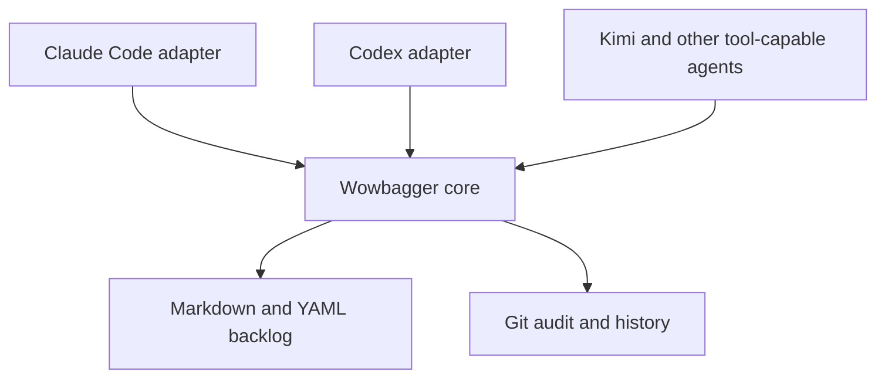

# wowbagger

**The backlog may be infinite. The next issue should not be ambiguous.**

Wowbagger is harness-neutral backlog coordination for coding agents, built on
plain Markdown and Git. It is intended to give agents durable work memory,
dependency-aware task selection, and auditable multi-worktree coordination without
putting a database or hosted service inside your repository.

> **Status: pre-alpha and self-hosted.** The standalone core validates a
> Markdown ledger, selects deterministic priority-ordered ready tasks, and
> implements guarded local `capabilities`, `inspect`, `create`, `transition`,
> and `patch` commands, plus `mint-id` for canonical item IDs. Its mutation
> scope is deliberately narrow: cooperative writers in one working copy, one
> item at a time. A Claude Code adapter and plugin ship from this
> repository; the adapter answers the negotiation surface of the harness-neutral
> contract and passes all 183 assertions across all 15 cases on native Darwin,
> although no manifest platform is claimed `supported` yet. The shipped core
> mutation contract and adapter contract are version 2; their frozen version 1
> definitions are not silently negotiated. The core implements advisory work claims (`acquire`,
> `renew`, `release`, `read`), visible across the worktrees of one repository.
> They coordinate cooperating agents but enforce nothing: a non-cooperating
> writer still wins. Fenced work claims still require a transactional
> coordinator and are not available from the core CLI.

## Start here

Install the core CLI, then verify it:

```sh
npm install -g wowbagger   # public npm registry (released versions)
# or, from this repository's git tag:
# npm install -g github:lstutzman/wowbagger
wowbagger capabilities --json
```

In Claude Code, add the plugin:

```
/plugin marketplace add lstutzman/wowbagger
/plugin install wowbagger@wowbagger
```

The plugin drives the installed core rather than bundling one, so a version
mismatch is detectable instead of silent: it reads `contract_version` from
`capabilities` and refuses when the core is absent or reports anything it does
not support. It will not fall back to editing ledger files by hand, because that
would bypass validation and atomic publication.

To use the core directly from a clone instead, see
[Core commands](#core-commands).

## Installation, compatibility, and security

### Installation routes

Wowbagger ships as an npm package with a single `wowbagger` binary. There are
two supported install routes:

- **npm registry** — `npm install -g wowbagger` installs a released version.
- **git tag** — `npm install -g github:lstutzman/wowbagger` installs this
  repository at a ref. A release is a git tag; installing at a ref installs the
  core and every adapter that ref carries.

Either route installs the core and the `wowbagger` command. The Claude Code
plugin is a separate artifact (see [Start here](#start-here)); the core and the
plugin are installed and versioned independently, and a mismatch is refused by
`contract_version` rather than guessed.

### Compatibility

The behavioural version is `contract_version`, reported by
`wowbagger capabilities --json`. Contracts change it; refactors do not. The
distribution version is the npm/git version, which names bytes, not behaviour.
Match on `contract_version` — never on the package version — when you decide
whether a core supports your request.

- **Node.js:** 20 and later. The adapter conformance vectors run against Node
  20 and the current runtime before each release.
- **Platforms:** the core runs wherever Node.js runs, but a formal `supported`
  platform claim is still `unverified` (they become verified per-platform only
  with release evidence). Do not assume a platform is officially supported just
  because the CLI starts.
- **Other tooling:** `wowbagger` manages a Git-tracked Markdown ledger. It
  needs `git` present for work-claim and namespace operations.

### Security

- **Read-only by default.** `validate`, `ready`, `inspect`, `capabilities`, and
  `mint-id` never modify anything. Every mutation (`create`, `transition`,
  `patch`) is an explicit, reviewable write.
- **Lock is not a claim.** A short mutation lock serializes writers during a
  single operation; it is not a work claim and grants no coordination
  guarantee.
- **Claims are advisory.** `claim` operations record a courtesy note that
  someone is working on an item; they enforce nothing and two agents can hold
  the same claim. Fenced claims are unimplemented.
- **Local authority only.** The core coordinates within a Git working copy; it
  does not mediate across machines, clones, or uncooperative writers. It is
  not a sandbox against a process racing the filesystem.
- **Supply chain.** Install only from the npm registry or this repository's
  git tags, and verify the `contract_version` your adapter or script requires.

This README is documentation, not a substitute for the contracts. The
machinery behind these properties is specified in [SPEC.md](SPEC.md),
[docs/mutation-contract.md](docs/mutation-contract.md), and
[docs/work-claim-contract.md](docs/work-claim-contract.md).

## Upgrading from an earlier wowbagger

This section is written for agents as much as humans: if you already drive a
wowbagger core, this is how you move forward safely.

Upgrade the pieces you installed:

```sh
npm install -g wowbagger@latest                # public npm registry
npm install -g github:lstutzman/wowbagger      # or: a direct git-tag install
git pull && npm ci                            # or: a direct checkout
```

In Claude Code, update the plugin the same way it was installed:

```
/plugin marketplace update wowbagger
/plugin update wowbagger@wowbagger
```

Then verify, exactly as on first install:

```sh
wowbagger capabilities --json
```

`contract_version` is the compatibility gate. The plugin and adapter refuse a
core that reports a version they do not support; if you automate against the
core directly, do the same rather than guessing.

The shipped adapter selects only adapter contract version 2 and requires core
contract version 2. A v1-only consumer receives
`unsupported-adapter-contract-version`; it does not receive v2 behavior. The
schema-2 transport is available. Ledger migration remains a separate quiesced
maintenance operation. The
[schema-2 migration runbook](docs/schema-2-migration.md) documents the required
backup, dry run, explicit `--apply`, lock refusal, and recovery procedure. The
tool is dry-run-only by default:

```sh
TMPDIR=/tmp node scripts/migrate-schema-2.js --ledger path/to/ledger
```

Behaviour changes are recorded in [CHANGELOG.md](CHANGELOG.md) — read its
Unreleased section on every upgrade. If you automated against an earlier
core, these are the changes most likely to touch you:

- **Stop hand-editing frontmatter for priority or number.** `wowbagger patch`
  changes both under the same revision compare-and-swap and per-ID lock as
  `transition`. Hand-edits bypass validation and atomic publication.
- **Delete your local ULID generator.** `wowbagger mint-id --json` prints a
  canonical ID; `--date YYYY-MM-DD` selects the creation date the ID must
  encode.
- **Read `core.number` and `core.priority` from results** instead of decoding
  `source_base64`. Every frontmatter field lives under `item.core`; `item.id`
  is the one deliberate duplicate.
- **`ready` without `--json` is for you to read**: `#number pri=priority
  title` per line, in ready order. Machine consumers keep `ready --json`,
  which is byte-stable.
- **A claim request with an own `__proto__` member is now refused** as
  `invalid-request` instead of silently losing the member.
- **`create` tells you where the item landed**: results report
  `core.status: "triage"`, and the refusal for a caller-supplied `status`
  names the accepting transition (triage to backlog) that makes an item
  ready.

## Why the name?

Wowbagger the Infinitely Prolonged is a Douglas Adams character faced with an
absurdly large, strictly ordered list and the prospect of working through it
one entry at a time.

That is also a fair description of software maintenance.

The project is an independent literary nod and is not affiliated with or
endorsed by Douglas Adams' estate.

## The problem

Coding agents lose context. They are restarted, compacted, moved between
worktrees, or replaced by a different model. A useful backlog therefore cannot
live only in one conversation or one harness's private state.

Wowbagger makes the repository the durable coordination boundary:

- One inspectable Markdown file per backlog item.
- YAML metadata for lifecycle, priority, dependencies, and structured provenance.
- Git history as the audit log and recovery mechanism.
- Dependency-aware ready queues so an agent can ask what is actionable now.
- Guarded one-item creation and lifecycle transitions with exact-byte
  revisions, cooperative locks, and explicit refusal when a change needs a
  multi-item transaction.
- A documented adapter boundary for tool-capable agent harnesses, without
  coupling the core to one vendor.
- Mechanical validation and derived reports instead of duplicated status data.

## Harness-neutral by design

Claude Code is an adapter, not the architecture. The core schema and command
interface will not depend on Claude-specific hooks, slash commands, paths, or
environment variables.



The documented compatibility targets are:

- Claude Code
- OpenAI Codex
- Kimi and other OpenAI-compatible model APIs hosted in agent harnesses that
  provide repository filesystem and command-execution tools

An OpenAI-compatible API describes model transport; it does not by itself
provide agent tools. The [adapter contract](docs/adapter-contract.md) records
the required host capabilities and refusal rules, and
[the integration guide](docs/openai-compatible-integration.md) states what a
Kimi or other OpenAI-compatible host can do today — driving the core CLI
directly — versus what a verifiable compatibility claim requires. Neither
claims that API compatibility alone makes a harness compatible.

This checkout ships three adapter packages on one shared entrypoint runtime:
[`adapters/claude-code/`](adapters/claude-code/), [`adapters/codex/`](adapters/codex/),
and [`adapters/opencode/`](adapters/opencode/). Each answers the section 3.3 bootstrap
wire with its own identity and honest host declaration. The native Darwin
Claude Code report passes all 183 assertions across all 15 cases — run
`node spec/run-adapter-implementation.js` to see the evidence. Codex and
OpenCode share the version 2 engine and execute all 183 assertions with
`--target codex` or `--target opencode`, but both target reports remain `fail`
pending target-specific evidence. Invocation forwarding, path and limit guards,
approval, and context all enter through the shared shipped engine. Platform
declarations remain `unverified` until their separate release evidence is
accepted. The Kimi and
OpenAI-compatible harness adapters are not written.

## Core commands

The current core requires Node.js 20 or later. From a Wowbagger checkout, `./bin/wowbagger.js --help`
prints the full command inventory, `./bin/wowbagger.js <command> --help` prints that
command's usage, and `./bin/wowbagger.js --version` prints the installed package
version. The commands below are the current inventory:

```sh
npm ci
./bin/wowbagger.js validate --ledger path/to/ledger --json
./bin/wowbagger.js ready --ledger path/to/ledger --as-of 2030-01-15 --json
./bin/wowbagger.js ready --ledger path/to/ledger --as-of 2030-01-15
./bin/wowbagger.js capabilities --json
./bin/wowbagger.js mint-id --json
./bin/wowbagger.js inspect --ledger path/to/ledger --id wb_... --json
./bin/wowbagger.js create --ledger path/to/ledger --input request.json --json
./bin/wowbagger.js transition --ledger path/to/ledger --input request.json --json
./bin/wowbagger.js patch --ledger path/to/ledger --input request.json --json
```

`validate` writes exactly one JSON result to standard output. A valid ledger
returns:

```json
{"valid":true,"errors":[]}
```

`ready` validates first, then returns only the normative ready result:

```json
{"as_of":"2030-01-15","valid":true,"ready":["wb_..."]}
```

`validate` and `ready` require `--ledger`; `ready` also requires an ISO
calendar `--as-of` date. Without `--json`, `ready` prints a human queue —
`#number pri=priority title` per ready item — while `ready --json` stays
byte-stable for machine consumers. Invalid ledgers return the validation JSON and
exit nonzero. The core rejects invalid UTF-8, symbolic-link entries, unreadable
paths, and `.md` special files rather than returning a partial view. Real
directories ending in `.md` remain containers and are traversed. These checks
provide deterministic read hygiene; they are not a sandbox against a privileged
process racing filesystem changes.

`inspect` returns a lossless raw-byte snapshot and its SHA-256 revision.
`create` publishes only a caller-supplied canonical ID through atomic
no-clobber publication — `mint-id` prints one, so no consumer writes base32
by hand. `transition` compares the inspected revision while cooperative
per-ID locks are held, then changes one lifecycle item or refuses the request
if dependent cleanup or child disposition would require changing another
item. `patch` changes the caller-supplied `number` and `priority` fields —
nothing else — under the same lock and compare-and-swap. See [the mutation contract](docs/mutation-contract.md) for the
JSON request, response, recovery, and scope details. A lock is never a work
claim. See [the fenced work-claim contract](docs/work-claim-contract.md) for
the separate future claim protocol and its strict backend boundary.

The `contract_version` reported by `capabilities` is what an adapter or plugin
declares it requires. A consumer pairing one with a core that reports a
different contract version gets a refusal, not a guess. Direct checkout use —
`./bin/wowbagger.js` from a clone — remains supported and is what this
repository's own ledger uses.

## Verify a checkout

The development workflow is intentionally self-hosted: edit code and ledger
fixtures locally, run the deterministic checks, and review the resulting Git
diff. Node.js 20 or later is required.

```sh
npm ci
npm test
npm audit --omit=dev
git diff --check
./bin/wowbagger.js validate --ledger ledger --json
```

The claim/fencing contract has its own normative documentation and fixtures in
[`docs/work-claim-contract.md`](docs/work-claim-contract.md); it remains an
in-progress protocol until merged and implemented by a supported backend.

## This repository's ledger

Wowbagger dogfoods its own draft format in the repository-local
[`ledger/`](ledger/) directory. Two epics divide the work, and the boundary is
clean: if it changes what the core does it belongs to standalone v0; if it
changes how the core reaches a consumer it belongs to productization. A
separate, triage-only item records a possible future PropertyCompass backlog
migration as a deferred consumer decision, gated on fenced claims. From a
checkout, query the ledger with the current UTC date in place of `YYYY-MM-DD`:

```sh
./bin/wowbagger.js validate --ledger ledger --json
./bin/wowbagger.js ready --ledger ledger --as-of YYYY-MM-DD --json
```

See [CONTRIBUTING.md](CONTRIBUTING.md) for the small set of ledger-maintenance
rules and the limits of the local mutation runtime.

## Design principles

1. **Markdown is canonical.** Humans can inspect and edit the backlog using
   ordinary repository tools.
2. **Git provides auditability and conflict detection.** Do not introduce a
   second version-control system or an opaque synchronization layer.
3. **Derived state stays derived.** Ready queues, epic progress, and reports are
   computed rather than stored twice.
4. **Mechanism and policy are separate.** Lifecycle and generic ledger
   mechanics can be reused while each host repository keeps its own priorities
   and vocabulary.
5. **Adapters stay thin.** Harness packaging translates into the stable core;
   it does not fork core behavior.
6. **The implementation remains auditable.** Coordination tooling should be
   small enough for a human to understand and repair.

## Repository shape

```text
src/            The core, and the shared adapter engine in src/adapter/
bin/            The wowbagger executable
adapters/       Harness packaging — claude-code, codex, and opencode packages
skills/         Portable agent workflows shipped by the plugin
spec/           Ledger schema, the adapter reference model, and normative fixtures
test/           The test suite
docs/           Contracts, integration guidance, and handoffs
scripts/        Maintenance commands that stay outside the core mutation contract
ledger/         This repository's own backlog, managed by wowbagger itself
```

`spec/adapter-reference.js` is an independent oracle. `src/adapter/`
deliberately re-implements it rather than importing it, and a differential test
holds the two together — the same arrangement `src/claim-request.js` has with
`test/work-claim-reference.js`. Collapsing either pair into a shared
implementation would make its conformance tests prove nothing.

The layout may change before the first release. The separation between the core
and its adapters will not.

## What Wowbagger is not

- An autonomous software factory or agent scheduler.
- A hosted issue tracker.
- A hidden agent-memory database.
- A Claude Code-only plugin.
- A replacement for engineering judgment about what should be built.

It is the durable work ledger beneath those systems.

## Roadmap

- Publish a standalone Markdown ledger contract and synthetic compatibility
  fixtures.
- Provide read-only validation and deterministic ready selection by creation
  order before mutable coordination. **Implemented in this checkout; not yet a
  stable release.**
- Implement the local-filesystem inspect, create, and single-item
  lifecycle-transition contract, including lossless exact-byte inspection,
  caller-known IDs, atomic no-clobber creation or refusal, and explicit
  multi-item refusal. **Implemented and covered by black-box vectors; still
  pre-alpha and intentionally local in scope.**
- Separate optional reusable mechanisms from consumer-specific policy.
- Stabilize the machine-readable command contract and compatibility evidence.
- Ship Claude Code and Codex adapters. **Claude Code, Codex, and OpenCode
  packages share the version 2 engine; the Claude Code Darwin target passes
  all 183 assertions, while the other target reports and all manifest platform
  declarations remain unverified.**
- Document the generic tool contract for other agent harnesses.
- Complete and review the separate fenced claim and resolution contract;
  local mutation locks are not claims. **Advisory Git-common-directory claims
  are implemented, but they do not fence publication or widen mutation scope.**
- Treat any PropertyCompass adoption as a later, separately-scoped consumer
  project.

## Contributing

The project has a pre-alpha standalone core. Issues describing concrete
portability requirements, coordination failures, or harness-integration
constraints are welcome. Please avoid proposing harness-specific behavior in
the core when it can live in an adapter.

For a change, create a focused branch, keep ledger edits reviewable, run the
verification commands above, and open a pull request with the tests and
contract links that justify the change. Do not claim support for an adapter or
fenced backend until its contract and implementation have merged.

## License

Licensed under the [Apache License 2.0](LICENSE).
