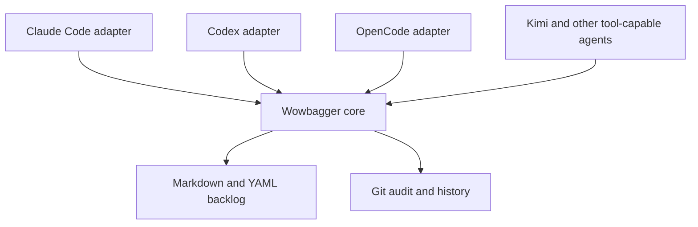

# wowbagger

**The backlog may be infinite. The next item should not be ambiguous.**

Wowbagger is a work ledger for coding agents. Every backlog item is one
Markdown file in your repository; every lifecycle change is a reviewable Git
diff. There is no database, no hosted service, and no private agent memory to
lose.

**Who it is for.** Maintainers running one or more coding agents across
worktrees, sessions, and models, who need the backlog to survive a compaction, a
restart, or a change of harness — and who want the agent's writes guarded rather
than trusted.

**What you get.** A deterministic ready queue that answers "what is actionable
today". Guarded single-item writes with exact-byte compare-and-swap, so an agent
cannot silently clobber your edit. Honest capability discovery, so a tool can
tell what this core will and will not promise. A shipped skill that teaches an
agent to use those guarantees instead of hand-editing your Markdown.

**Start here:** [install the core and set up a ledger](#start-here).

> **Status: alpha, published, and self-hosted.** `0.1.0-alpha.6` is on npm under
> the `next` tag and on this repository's `v0.1.0-alpha.6` tag. It is the
> version this repository runs its own backlog on. The API is not frozen and the
> version will move before a stable release.
>
> **Install with `@next`.** Every published release is a prerelease. The
> registry requires a `latest` dist-tag, so `latest` mirrors `next` — a bare
> `npm install wowbagger` resolves to the current prerelease rather than an
> older build — but `@next` is the documented install and the explicit
> statement that you accept a prerelease.
>
> **What is proved.** The core validates a Markdown ledger, selects a
> deterministic ready queue, renders a self-contained HTML report, and
> implements guarded `inspect`, `create`, `transition`, and `patch`, plus
> `mint-id`, `capabilities`, `provision`, the `claim` lifecycle,
> `publish-claimed`, `claim-verify`, and `claim-adopt`. The core contract
> version is **3**. Three adapter packages ship — Claude Code, Codex, and
> OpenCode — on one shared engine at adapter contract version 2. Only the Claude
> Code adapter declares a `supported` platform, Darwin, from a native run of all
> 210 conformance assertions across all 16 cases. Every other adapter and
> platform declaration is `unverified`; do not infer support because the CLI
> starts.
>
> **What is not a lock.** A work claim is not an exclusive dispatch lease. On a
> provisioned Git-backed ledger, claims coordinate cooperating agents through a
> durable journal in Git's shared common directory: `claim acquire` uses
> observed-state compare-and-swap, `publish-claimed` fences one item against the
> active owner generation and expected revision, and `claim-verify` reconciles
> response-loss and post-merge outcomes. Capability discovery therefore reports
> `mode: "merge-coordinated"` and `safe_exclusive_dispatch: false`. Direct
> filesystem writes, hostile processes, other clones, and non-claim-aware tools
> still bypass the protocol.

## Start here

Install the core CLI, then verify it:

```sh
npm install -g wowbagger@next   # public npm registry
# or, from this release's Git tag:
# npm install -g github:lstutzman/wowbagger#v0.1.0-alpha.6
wowbagger --version         # 0.1.0-alpha.6
wowbagger capabilities --json
```

In Claude Code, add the plugin:

```
/plugin marketplace add lstutzman/wowbagger
/plugin install wowbagger@wowbagger
```

The plugin drives the installed core rather than bundling one, so a mismatch is
detectable instead of silent. Its skill reads `wowbagger --version` and
`capabilities`; it requires the same distribution version as the plugin and core
`contract_version: 3`. It refuses an absent or incompatible core. It will not
fall back to editing ledger files by hand, because that would bypass validation
and atomic publication.

### Set the ledger up before the first item

Decide where items live **before your first `create`**. A ledger publishes items
to `<ledger>/<id>.md` unless a committed `<ledger>/.wowbagger/layout.json` binds
a subdirectory:

```sh
mkdir -p path/to/ledger/.wowbagger path/to/ledger/items
echo '{"layout_version":1,"items_directory":"items"}' > path/to/ledger/.wowbagger/layout.json
```

`layout_version` must be `1` and `items_directory` names the committed item
directory. `create` then publishes atomically to `<items_directory>/<id>.md`,
and validation rejects parsed items outside it. Commit the directory the file
names — `create` publishes into an existing directory and does not make one.
Nothing is renamed after a create. This repository dogfoods that binding: its
own items live in [`ledger/items/`](ledger/items/).

If your items mirror an external tracker and carry your own identifier fields,
declare them now too. `<ledger>/.wowbagger/extensions.json` is what makes a
consumer-owned extension member patchable:

```sh
echo '{"extensions_version":1,"members":{"external_id":"string"}}' \
  > path/to/ledger/.wowbagger/extensions.json
```

Each member declares one value type — `string`, `integer`, `boolean`, or
`string-list`. **A ledger without that file has no patchable extension member at
all**, and a `set.extensions` patch against it is refused by name. The
declaration authorizes a write; it never describes the ledger, so `validate`
does not read it. Both files are ledger setup, not runner configuration: commit
them.

Cores at `0.1.0-alpha.4` and earlier ignore the layout file and publish every
item at the ledger root.

On such a core, relocating an item by hand has a trap. `create` writes an
untracked file, so `git mv` refuses the path it just published; an unchecked
batch then runs `git add -A` and commits the item at the ledger root, where it
silently stays. Use plain `mv`, then `git add` both paths, and check the exit
code of every command before the commit:

```sh
mv path/to/ledger/<id>.md path/to/ledger/items/<id>.md || exit 1
git add path/to/ledger || exit 1
```

A committed item outside the configured items directory then fails validation
and refuses every read and every guarded mutation on that ledger, including
ones that never touch it. The refusal names the expected path and the
relocation that repairs it.

### File the first item

Every command below takes `--json` and writes exactly one JSON object to
standard output. `mint-id` prints a canonical ID so no caller writes base32 by
hand:

```sh
wowbagger mint-id --json                     # -> result.id
cat > request.json <<'JSON'
{
  "id": "wb_...",
  "item": {
    "title": "Map the fictional route",
    "kind": "task",
    "priority": 2,
    "provenance": { "source": "user-request", "recorded_at": "2030-01-10T12:34:56.789Z" },
    "depends_on": [],
    "related": []
  },
  "body": "\n# Problem\n\nWhat is wrong.\n\n# Acceptance criteria\n\n1. ...\n"
}
JSON
wowbagger create --ledger path/to/ledger --input request.json --json
```

The item lands in `triage` with a core-assigned `number` — the integer handle
you say out loud. `create` does not accept a `number` and does not accept a
`status`. Move it into the backlog with an explicit accepting transition, then
ask what is workable:

```sh
wowbagger inspect    --ledger path/to/ledger --number 1 --json   # -> revision
wowbagger transition --ledger path/to/ledger --input accept.json --json
wowbagger ready      --ledger path/to/ledger --as-of YYYY-MM-DD
```

`transition` fences on the `expected_revision` that `inspect` just returned, so
inspect immediately before you transition. On a provisioned ledger, commit each
mutation before running the next one — see
[Commit each mutation before the next one](#commit-each-mutation-before-the-next-one).

For an isolated consumer pilot, create or select the disposable worktree before
the agent starts. Then launch a new session with that worktree as its project
root. Follow the [isolated dogfood pilot runbook](docs/isolated-dogfood-pilot.md);
do not try to drive a sibling worktree from an already-running agent session.

To use the core directly from a clone instead, see
[Core commands](#core-commands).

## Why the name?

Wowbagger the Infinitely Prolonged is a Douglas Adams character faced with an
absurdly large, strictly ordered list and the prospect of working through it
one entry at a time.

That is also a fair description of software maintenance.

The project is an independent literary nod and is not affiliated with or
endorsed by Douglas Adams' estate.

## Why adopt the skill instead of editing Markdown by hand

The ledger is plain Markdown, so an agent *can* edit it with a text editor. The
skill exists because four things break when it does.

- **Validation is whole-ledger and fail-closed.** One malformed item refuses
  every read and every guarded mutation on that ledger, including commands that
  never touch it. A hand-edit finds that out later, and usually in someone
  else's session. `create`, `transition`, and `patch` validate the complete
  candidate ledger *before* publishing anything, and refuse `unchanged`.
- **A hand-edit has no lost-update guard.** Every guarded write takes the exact
  SHA-256 revision `inspect` returned and refuses if the bytes moved. An editor
  writes over whatever is there.
- **Publication is atomic and no-clobber.** A guarded write either lands whole
  or does not land. A half-written item from an interrupted editor is a broken
  ledger.
- **On a provisioned ledger, a hand-edit is a stale write.** The claim journal
  validates recorded mutations against Git `HEAD`. An out-of-protocol edit makes
  the next mutation refuse exit 6 `unauthorized-revision`, and every later
  mutation stays blocked until an operator rules on it. The protocol used to
  force that edit for a wrong title; it no longer does — `patch` covers it.

What the skill adds on top of the CLI is the part an agent gets wrong unaided:
it checks the core version before the first command, it says **#N** to people
and ULIDs to the tool, it reads acceptance criteria out of the item body rather
than the metadata, it derives an epic's progress from its children instead of
its status, and it tells the user before a batch that filing ten items means ten
commits, not one.

It also refuses to fall back. If the core is absent or the contract version is
not 3, the skill stops and says so. It does not quietly start editing files.

## Core, adapter, skill, plugin

Four separate things, deliberately:

| Piece | What it is | Where it lives |
|---|---|---|
| **core** | The `wowbagger` CLI. Harness-neutral; it knows no vendor. | `src/`, `bin/`, npm package `wowbagger` |
| **adapter** | Per-harness machinery that lets an agent drive the core safely: negotiation, capability checks, forwarding, honest outcome mapping. It owns no lifecycle logic. | [`adapters/`](adapters/) |
| **skill** | Harness-native instructions telling an agent *when* and *how* to use the core. | [`skills/wowbagger/SKILL.md`](skills/wowbagger/SKILL.md) |
| **plugin** | The Claude Code distribution wrapper: marketplace entry, skill, adapter. Self-hosted from this repository. | [`.claude-plugin/`](.claude-plugin/) |

The core and the plugin install independently and must carry matching
distribution versions. The core contract version and the adapter contract
version are separate domains: the core is at **3**, the adapter is at **2**, and
the legacy work-claim, ledger-publication, and ledger-mutation envelopes stay at
**1**.

## Installation, compatibility, and security

### Installation routes

Wowbagger ships as an npm package with a single `wowbagger` binary. There are
two supported install routes:

- **npm registry** — `npm install -g wowbagger@next` installs the current
  prerelease. `@next` is the documented spelling; `latest` mirrors it (the
  registry requires a `latest` tag), so a bare install resolves to the same
  bytes.
- **git tag** —
  `npm install -g github:lstutzman/wowbagger#v0.1.0-alpha.6` installs this
  release. Installing at a ref installs the core and every adapter that ref
  carries.

Either route installs the core and the `wowbagger` command. The Claude Code
plugin is a separate artifact (see [Start here](#start-here)).

### Compatibility

The contract version is top-level `contract_version`, reported by
`wowbagger capabilities --json`. Contracts change it; refactors do not. The
npm/Git distribution version names release bytes. General API consumers
negotiate the contract version. The shipped plugin skill additionally requires
the exact core distribution version that shipped with it, because its
instructions can depend on additive behavior from that release.

A widening inside one contract version does not move it, so the version field
cannot answer every question. `set.body_append` and `set.extensions` both
shipped after `0.1.0-alpha.5` published `contract_version: 3`. Probe for them by
sending the request and reading the refusal — an `unknown-member` issue at
`/set/body_append` means the core predates the append — or pin the distribution
version.

- **Node.js:** 20 and later. The adapter conformance vectors run against Node
  20 and the current runtime before each release.
- **Platforms:** the core runs wherever Node.js runs. The Claude Code adapter
  declares Darwin `supported` from native common-vector evidence. Linux,
  Windows, and every other shipped adapter target remain `unverified`.
- **Other tooling:** `wowbagger` manages a Git-tracked Markdown ledger. It
  needs an accessible Git checkout for work-claim and namespace operations.
  Before `provision`, run
  `wowbagger claim capabilities --ledger <dir> --json` and require
  `result.operations.work_claim.supported: true`.

### Security

- **Read-only by default.** `validate`, `ready`, `report`, `inspect`,
  `capabilities`, and `mint-id` never modify anything. Every mutation
  (`create`, `transition`, `patch`, and `publish-claimed`) is an explicit,
  reviewable write.
- **Lock is not a claim.** A short mutation lock serializes writers during one
  operation. It does not grant a work claim.
- **Claims are merge-coordinated, not exclusive.** `claim acquire` uses
  compare-and-swap against the observed claim state. `publish-claimed` checks
  the active owner generation and expected ledger revision before it writes
  one item. `claim-verify` records the final Git outcome and detects later
  revision drift. Legacy `create` and `transition` refuse claim conflicts.
- **Adopting a revision is an operator ruling, not an escape hatch.**
  `claim-adopt` moves the authorized revision to one named committed revision
  and stops. It writes no item byte, it is per item and per revision explicit,
  there is no adopt-all, and the next out-of-protocol edit refuses again.
- **Local authority only.** The protocol protects cooperating worktrees in one
  Git repository. It does not stop direct filesystem writes, hostile
  processes, other clones, or alternate write paths. Capability discovery
  therefore reports `mode: "merge-coordinated"` and
  `safe_exclusive_dispatch: false`.
- **Supply chain.** Install only from the npm registry or this repository's
  git tags, and verify the `contract_version` your adapter or script requires.

This README is documentation, not a substitute for the contracts. The machinery
behind these properties is specified in the documents listed under
[Where the contracts live](#where-the-contracts-live).

## Upgrading from an earlier wowbagger

This section is written for agents as much as humans: if you already drive a
wowbagger core, this is how you move forward safely.

Upgrade the pieces you installed:

```sh
npm install -g wowbagger@next                  # public npm registry
npm install -g github:lstutzman/wowbagger#v0.1.0-alpha.6  # immutable Git release
git pull && npm ci                            # or: a direct checkout
```

In Claude Code, update the plugin the same way it was installed:

```
/plugin marketplace update wowbagger
/plugin update wowbagger@wowbagger
```

```sh
wowbagger --version
wowbagger capabilities --json
```

The plugin requires its exact core distribution version and top-level core
`contract_version: 3`. Direct API consumers must check the contract version
they support; installed plugin users must also keep the plugin and core
distribution versions equal.

The shipped adapter selects only adapter contract version 2 and requires core
contract version 3. The adapter contract and the core contract are separate
version domains: the adapter stays at 2 while the core moves to 3. A v1-only
consumer receives `unsupported-adapter-contract-version`; it does not receive v2
behavior. The schema-2 transport is available. Ledger migration remains a
separate quiesced maintenance operation. The
[schema-2 migration runbook](docs/schema-2-migration.md) documents the required
backup, dry run, explicit `--apply`, lock refusal, and recovery procedure. The
tool is dry-run-only by default:

```sh
TMPDIR=/tmp node scripts/migrate-schema-2.js --ledger path/to/ledger
```

Behaviour changes are recorded in [CHANGELOG.md](CHANGELOG.md) — read its
Unreleased section on every upgrade. If you automated against an earlier
core, these are the changes most likely to touch you:

- **Stop hand-editing frontmatter.** `wowbagger patch` now covers `title`,
  `priority`, `depends_on`, `related`, the body, and every extension member the
  ledger declares, all under the same per-ID lock and revision
  compare-and-swap as `transition`. Hand-edits bypass validation and atomic
  publication, and on a provisioned ledger they block the next mutation.
- **`number` is not yours.** On schema version 2 the core assigns the number at
  `create` and refuses a caller-supplied one; `patch` refuses it because it is
  immutable identity. Keep a legacy identifier in a declared extension member or
  in the item body.
- **Delete your local ULID generator.** `wowbagger mint-id --json` prints a
  canonical ID; `--date YYYY-MM-DD` selects the creation date the ID must
  encode.
- **Read `core.number` and `core.priority` from results** instead of decoding
  `source_base64`. Every frontmatter field lives under `item.core`; `item.id`
  is the one deliberate duplicate.
- **`ready` without `--json` is for you to read**: `#number pri=priority
  title` per line, in ready order. Machine consumers keep `ready --json`,
  which is byte-stable.
- **A claim request with an own `__proto__` member is now refused** as
  `invalid-request` instead of silently losing the member.
- **`create` tells you where the item landed**: results report
  `core.status: "triage"`, and the refusal for a caller-supplied `status`
  names the accepting transition (triage to backlog) that makes an item
  ready.
- **Bind a subdirectory layout in the ledger, not in each runner.** Commit
  `<ledger>/.wowbagger/layout.json` with
  `{"layout_version":1,"items_directory":"items"}`. `create` then derives
  `<ledger>/items/<id>.md`; validation rejects parsed items outside `items/`.
  Without the file, the compatible layout remains `<ledger>/<id>.md`.
- **A date refusal now carries the item's own dates.** `date-before-created`
  and `date-before-updated` both carry `item_created` and `item_updated`, so
  correcting the request costs no `inspect` round-trip. Item dates derive from
  the ULID timestamp, which is UTC: an item minted just after midnight UTC
  carries tomorrow's date for anyone west of UTC.

## The problem

Coding agents lose context. They are restarted, compacted, moved between
worktrees, or replaced by a different model. A useful backlog therefore cannot
live only in one conversation or one harness's private state.

Wowbagger makes the repository the durable coordination boundary:

- One inspectable Markdown file per backlog item.
- YAML metadata for lifecycle, priority, dependencies, and structured provenance.
- Git history as the audit log and recovery mechanism.
- Dependency-aware ready queues so an agent can ask what is actionable now.
- Guarded one-item creation, patching, and lifecycle transitions with
  exact-byte revisions, cooperative locks, and explicit refusal when a change
  needs a multi-item transaction.
- A documented adapter boundary for tool-capable agent harnesses, without
  coupling the core to one vendor.
- Mechanical validation and derived reports instead of duplicated status data.

## Harness-neutral by design

Claude Code is an adapter, not the architecture. The core schema and command
interface will not depend on Claude-specific hooks, slash commands, paths, or
environment variables.



The documented compatibility targets are:

- Claude Code
- OpenAI Codex
- OpenCode
- Kimi and other OpenAI-compatible model APIs hosted in agent harnesses that
  provide repository filesystem and command-execution tools

An OpenAI-compatible API describes model transport; it does not by itself
provide agent tools. The [adapter contract](docs/adapter-contract.md) records
the required host capabilities and refusal rules, and
[the integration guide](docs/openai-compatible-integration.md) states what a
Kimi or other OpenAI-compatible host can do today — driving the core CLI
directly — versus what a verifiable compatibility claim requires. Neither
claims that API compatibility alone makes a harness compatible.

This checkout ships three adapter packages on one shared entrypoint runtime:
[`adapters/claude-code/`](adapters/claude-code/), [`adapters/codex/`](adapters/codex/),
and [`adapters/opencode/`](adapters/opencode/). Each answers the bootstrap wire
with its own identity and honest host declaration. Invocation forwarding, path
and limit guards, approval, and context all enter through the shared shipped
engine. Run the conformance suite to see the evidence:

```sh
TMPDIR=/tmp node spec/run-adapter-implementation.js                     # claude-code
TMPDIR=/tmp node spec/run-adapter-implementation.js --target codex
TMPDIR=/tmp node spec/run-adapter-implementation.js --target opencode
```

The native Darwin Claude Code report passes all 210 assertions across all 16
cases and reports `"status": "pass"`. Codex and OpenCode execute the same 210
assertions through the same engine, but both target reports remain `"fail"`
pending target-specific evidence, and every platform declaration on those two
manifests stays `unverified`. The Kimi and OpenAI-compatible harness adapters
are not written.

**All three shipped packages are read-only as they stand, and say so.** None
wires a consumer approval source, so each declares no trusted approval and
refuses `create`, `transition`, and `patch` with `capability-unavailable`
naming the missing capability, before any core process starts. Mutation
authority is a runtime dependency a host supplies in code: a process that
embeds `runAdapterEntrypoint` passes `hostRuntime` — the approval source, the
clock, the redeemed-nonce store, and the core executable identity it attests —
and its describe result then advertises trusted approval truthfully. The
approval never rides the bootstrap request, which the model controls;
`docs/adapter-contract.md` section 5.1 states the mechanism and its rules.

## Core commands

The current core requires Node.js 20 or later. From a Wowbagger checkout,
`./bin/wowbagger.js --help` prints the full command inventory,
`./bin/wowbagger.js <command> --help` prints that command's usage, and
`./bin/wowbagger.js --version` prints the installed package version. The
commands below are the current inventory:

```sh
npm ci
./bin/wowbagger.js validate --ledger path/to/ledger --json
./bin/wowbagger.js ready --ledger path/to/ledger --as-of 2030-01-15 --json
./bin/wowbagger.js ready --ledger path/to/ledger --as-of 2030-01-15
./bin/wowbagger.js report --ledger path/to/ledger --as-of 2030-01-15 --json
./bin/wowbagger.js capabilities --json
./bin/wowbagger.js mint-id --json
./bin/wowbagger.js inspect --ledger path/to/ledger --id wb_... --json
./bin/wowbagger.js inspect --ledger path/to/ledger --number 30 --json
./bin/wowbagger.js create --ledger path/to/ledger --input request.json --json
./bin/wowbagger.js transition --ledger path/to/ledger --input request.json --json
./bin/wowbagger.js patch --ledger path/to/ledger --input request.json --json
./bin/wowbagger.js provision --ledger path/to/ledger --json
./bin/wowbagger.js claim capabilities --ledger path/to/ledger --json
./bin/wowbagger.js claim acquire --ledger path/to/ledger --input request.json --json
./bin/wowbagger.js claim read --ledger path/to/ledger --input request.json --json
./bin/wowbagger.js claim renew --ledger path/to/ledger --input request.json --json
./bin/wowbagger.js claim release --ledger path/to/ledger --input request.json --json
./bin/wowbagger.js publish-claimed --ledger path/to/ledger --input request.json --json
./bin/wowbagger.js claim-verify --ledger path/to/ledger --json
./bin/wowbagger.js claim-adopt --ledger path/to/ledger --input request.json --json
```

`validate` writes exactly one JSON result to standard output. A valid ledger
returns:

```json
{"valid":true,"errors":[]}
```

`ready` validates first, then returns only the normative ready result:

```json
{"as_of":"2030-01-15","valid":true,"ready":["wb_..."]}
```

`validate` and `ready` require `--ledger`; `ready` also requires an ISO
calendar `--as-of` date. Without `--json`, `ready` prints a human queue —
`#number pri=priority title` per ready item — while `ready --json` stays
byte-stable for machine consumers. Invalid ledgers return the validation JSON and
exit nonzero. The core rejects invalid UTF-8, symbolic-link entries, unreadable
paths, and `.md` special files rather than returning a partial view. Real
directories ending in `.md` remain containers and are traversed. These checks
provide deterministic read hygiene; they are not a sandbox against a privileged
process racing filesystem changes.

`inspect` returns a lossless raw-byte snapshot and its SHA-256 revision, by
`--id` or by `--number`. `create` publishes only a caller-supplied canonical ID
through atomic no-clobber publication — `mint-id` prints one, so no consumer
writes base32 by hand. `transition` compares the inspected revision while
cooperative per-ID locks are held, then changes one lifecycle item or refuses
the request if dependent cleanup or child disposition would require changing
another item.

### What `patch` may change

`patch` re-scopes an existing item in band, under the same per-ID lock,
exact-byte compare-and-swap, candidate whole-ledger validation, and atomic
publication as `transition`. The patchable set is exactly:

| `set` member | Rule |
|---|---|
| `title` | Non-empty string, replaced whole. |
| `priority` | Non-negative integer; `null` removes it. |
| `depends_on` | Whole relation list, replaced. `[]` clears it. |
| `related` | Whole relation list, replaced; `null` removes it. |
| `body` | Whole body replaced. `""` empties it. **Never merges.** |
| `body_append` | Written after the current body. Mutually exclusive with `body`. |
| `extensions` | Container naming declared extension members; each value replaces that member whole, `null` removes it. |

A `set` member outside that list is an `invalid-request` issue at its `/set`
pointer — a typo becomes a refusal, never a new frontmatter member. `number`,
`kind`, and `provenance` are refused deliberately.

Two traps are worth carrying here rather than leaving to discovery. **A body
patch replaces and never merges:** a consumer mirroring an external source MUST
read-modify-write from the body `inspect` just returned and MUST never
regenerate from the source alone, because `expected_revision` is a byte-level
lost-update guard with no semantic safety at all. Use `set.body_append` when the
change is an addition. And **extension members are patchable only where the
ledger declares them** — see [Set the ledger up before the first
item](#set-the-ledger-up-before-the-first-item).

Which members you own at all is a three-way split — core-owned,
consumer-editable through `patch`, and create-once — stated member by member in
the mutation contract's **frontmatter ownership** table. Read the table; do not
send a patch and interpret the refusal.

### An epic's progress is derived, never stored

An epic stores no progress and has no `backlog -> in-progress` edge. Its
progress is the **terminal ratio**: direct children whose status is `done` or
`killed`, over all direct children. That is one definition with three surfaces —
the mutation contract, the epic completion rollup, and the report's
epic-enablement factor all read the same set. A terminal date is not the test: an
archived or deferred child is work postponed, not work retired, and does not
count.

### Diagnosing an invalid ledger

One invalid item refuses every read and every guarded mutation on that ledger,
including commands that never touch it. That refusal is the diagnosis, and no
command asks you to parse the Markdown by hand:

- `validate --json` lists every error. An error whose repair the validator can
  derive also carries `expected_path` and a `remediation` naming the repair.
- `inspect` still refuses with exit 3 `ledger-invalid` — a revision from an
  unjudged ledger must never look like a mutation precondition — but the
  refusal carries `error.details.item`, the complete snapshot of the item you
  asked for, whenever no validation error names that item's path. A faulted
  item is withheld; `validate` already names its repair.
- `claim-verify --json` reports `result.ledger_validation`. Exit 0 with
  `findings: []` and `ledger_validation.valid: false` says the claim journal is
  consistent and validation alone is blocking every mutation.

### Work claims

`provision` binds one ledger namespace to the repository. `claim` manages
durable acquire, read, renew, and release decisions. `publish-claimed` accepts
the exact candidate item bytes and fences their publication against the active
owner generation and expected revision. `claim-verify` reconciles pending
publication outcomes against the working tree and Git `HEAD`; run it after a
claimed publication is committed or merged, and before the next fenced
operation. `claim-adopt` is the non-destructive remedy described below.

Core and work-claim versions use distinct negotiation fields. Read the
top-level `contract_version` from core `capabilities`. Read
`result.operations.work_claim.api_version` from
`claim capabilities --ledger <dir> --json`. A claim response's top-level
`contract_version` is the legacy claim-envelope marker; do not compare it with
the core version. A contract consumer that receives an unsupported version
refuses rather than guessing. The shipped plugin skill also requires its exact
core distribution version. Direct checkout use — `./bin/wowbagger.js` from a
clone — remains supported and is what this repository's own ledger uses.

## Commit each mutation before the next one

On a **provisioned** ledger — one where `provision` has bound a namespace and
`claim capabilities` reports `mode: "merge-coordinated"` — there is one
operating rule:

**Commit each mutation to Git before running the next mutating command.**

The durable claim store validates every recorded mutation against Git `HEAD`,
not against working-tree bytes. That is what makes a recorded mutation durable
rather than a local edit one `git checkout` away from vanishing. An uncommitted
mutation is an unreconciled mutation, so the next `create`, `transition`, or
`patch` refuses instead of writing on top of it.

The loop that works:

```sh
./bin/wowbagger.js create --ledger path/to/ledger --input request.json --json
git add path/to/ledger && git commit -m "Record the mutation"
./bin/wowbagger.js claim-verify --ledger path/to/ledger --json
./bin/wowbagger.js transition --ledger path/to/ledger --input next.json --json
```

Skip the commit and the next command returns exit 6:

```json
{"ok":false,"namespace":"ledger-mutation","command":"create-v1","contract_version":1,
 "state":"unchanged","error":{"code":"claim-store-unavailable",
 "message":"The durable claim store is unavailable.",
 "details":{"reason":"publication-reconciliation-required","findings":[{
   "code":"stale-write-detected","reason":"git-finalization-required",
   "expected_path":"wb_....md",
   "remediation":"Commit wb_....md in Git, then run claim-verify."}]}}}
```

`state: "unchanged"` is exact — nothing was written. **`claim-verify` is the
reconciliation procedure.** Read `details.findings`, do what each
`remediation` string says, run `claim-verify` until it returns exit 0, then
repeat the refused command.

Batch work is where this bites. Filing ten items means ten commits, not one
commit at the end.

### Or fold the commit into the mutation

`--auto-commit` performs that whole loop inside one invocation, on a provisioned
ledger only:

```sh
./bin/wowbagger.js transition --ledger path/to/ledger --input next.json --json --auto-commit
```

It is opt-in per invocation. There is no configuration setting or environment
default, because a hidden default would make existing automation create Git
commits unexpectedly. The flag is accepted on `create`, `transition`, `patch`,
and `publish-claimed`.

What one flagged invocation does: refuse if anything is staged anywhere or any
path under the ledger is dirty; reconcile; run the mutation unchanged; commit
exactly the changed item and at most one
`.wowbagger/reconcile-<namespace>.md` with a fixed subject such as
`wowbagger: transition item #7`; verify the commit; then run `claim-verify`
before it answers. On success the result gains `git_commit`, `commit_paths`, and
`claim_verified`.

Unstaged and untracked files **outside** the ledger are left alone. Hooks and
signing are honoured; `--no-verify` is never passed. Nothing is pushed.

A refused mutation never commits. When the item is published but the commit
fails, the answer is exit 6 `git-commit-failed` with a recovery token, and one
idempotent command finishes the job:

```sh
./bin/wowbagger.js mutation-finalize --ledger path/to/ledger --recovery-token <token> --json
```

Repeating it creates no second commit, so a lost response and a failed commit
recover the same way. [docs/mutation-contract.md](docs/mutation-contract.md)
section 13 is the full contract.

### When the item was changed outside the protocol

An `unauthorized-revision` finding means someone edited the item without going
through a guarded verb. There are **two** remedies, and choosing between them is
an operator's decision, not the agent's:

- **Restore** the authorized revision, commit, and run `claim-verify`. This
  discards the edit.
- **Adopt** the committed revision with `claim-adopt`, then run `claim-verify`.
  This keeps the edit and moves the authorized revision to it.

```sh
./bin/wowbagger.js claim-adopt --ledger path/to/ledger --input adopt.json --json
```

Adoption is per item and per revision explicit — the request names the item, the
revision it believes is authorized, the revision being adopted, and who is
ruling. There is no adopt-all. It writes no item byte, so `updated` and the body
survive exactly, and it appends one `revision-adoption` journal entry so the
audit trail records the ruling. It refuses a stale witness, an unexpired claim on
the item, a revision that is not at Git `HEAD` and in the caller's own working
tree, and a ledger that would not validate. Adoption is not a fence hole: the
next out-of-protocol edit refuses again, measured against the adopted revision.

Full rules, the other blocking finding codes, and why validating against
working-tree bytes was rejected are in
[the mutation contract](docs/mutation-contract.md) section 12 and
[the work-claim contract](docs/work-claim-contract.md) sections 3.2 and 3.3.

## The HTML report

`report` validates the complete ledger, reads `.wowbagger/report.json`, and
atomically publishes one self-contained HTML file. The output must be outside
the ledger. Relative configured output paths resolve from `.wowbagger/`;
relative `--out` overrides resolve from the caller's working directory.

```json
{
  "report_version": 1,
  "repository": { "name": "Example repository", "logo": "logo.svg" },
  "title": "Ledger report",
  "output": "../../ledger-report.html",
  "fields": {
    "area": "/priority_area",
    "complexity": "/complexity",
    "rank": "/priority_rank",
    "class": "/class",
    "due": "/due"
  },
  "swarm": { "eligible_complexities": ["small", "medium"] }
}
```

`repository.logo`, `fields`, and `swarm` are optional. Field values resolve
from parsed frontmatter with RFC 6901 JSON Pointers. A swarm requires mapped
`area` and `complexity` fields. The report fetches nothing at view time.

The report is a **sequencing dashboard**, not a state snapshot. It opens with
**Work next**: the ready set in a recommended order, each entry carrying the
factors that placed it. Below it sit **Attention** (blocked work naming its
blockers, the oldest open work, and started work past this ledger's own
85th-percentile cycle time), then the **evidence layer**, then the **ledger
graph**. State counts, item cards, filters, grouping, detail levels, terminal
history, and area-diverse ready batches all remain, demoted below that decision
surface.

The evidence layer is inline SVG, drawn at generation time and embedded in the
file: an aging heatmap, weekly arrivals against completions, throughput with a
four-week mean, a cumulative flow area, accept-to-complete cycle time, and a
Monte Carlo forecast as 50, 85, and 95 percent bands. Each chart carries
`role="img"` and an aria-label that states its finding in words, so the evidence
survives a screen reader and a printout.

### The ledger graph

Below the evidence layer the report draws the whole ledger as a force-directed
3D graph. Every item is a node, labelled `#N`, coloured by readiness for open
items and by terminal status for closed ones, and sized by the same transitive
unblocking leverage the recommended order uses. Edges run from a prerequisite
or a parent to the item it releases: a `depends_on` edge is straight and
arrowed, a `parent` edge is curved and unarrowed. Hovering or clicking a node
opens a card with its number, title, status, age, leverage, and the same
reasons line the ranked list prints for it.

The renderer is [`3d-force-graph`](https://github.com/vasturiano/3d-force-graph)
over Three.js, vendored into `vendor/3d-force-graph/` at a pinned version
`1.80.0` with its upstream SHA-256 recorded in
[`vendor/3d-force-graph/VERSIONS.json`](vendor/3d-force-graph/VERSIONS.json) and
pinned by a test. It is inlined into the report at generation time. Nothing is
fetched from a CDN, at generation time or at view time, and the report's content
security policy forbids every remote load, `connect-src` included. The bundle
costs roughly 1.3 MB of the report's size; the report stays one self-contained
file you can attach, open offline, and share.

Without WebGL the graph section says so and expands its own roster instead: one
row per node, carrying that node's number, title, status, age, leverage, and
reasons. No decision-relevant content exists only in the 3D view.

The recommended order is a report-layer derivation. It is recomputed from
ledger bytes at render time, never persisted, never a mutation, and it does not
change `ready`: the core still selects and sorts by priority, created date,
then ID. Ordering runs as separate, visible steps rather than one opaque score
— expedite class, then due proximity, then transitive unblocking leverage over
`depends_on`, then epic enablement from `parent`, then priority, then age, then
the mapped `complexity` as a WSJF-style size denominator — and every step that
placed an entry is printed beside it.

Two mapped fields carry the value dimensions the schema deliberately does not:

- **`class`** — a class of service, one of `expedite`, `fixed-date`,
  `standard`, or `intangible`. `expedite` lifts an item above every other ready
  item. An absent value means `standard`. An unrecognised value is ranked as
  standard and reported by number in the report, never silently dropped.
- **`due`** — an ISO calendar date. The nearest due date sorts first and an
  overdue one sorts first of all; an item with no due date sorts behind every
  dated one at that step.

Both ride the ordinary extension-member channel, so the core neither reads nor
validates them. `complexity` weighs `xs`/`s`/`small` as 1, `m`/`medium` as 2,
`l`/`large` as 3, and `xl`/`extra-large` as 5; any other value carries no
weight and is shown as written.

This repository keeps its report configuration in
`ledger/.wowbagger/report.json`. Generate the ignored local report with the
current UTC date:

```sh
npm run report -- --as-of YYYY-MM-DD
```

## Where the contracts live

The README is the map. These are the territory, and they are normative where
they disagree with anything above:

| Document | What it rules |
|---|---|
| [SPEC.md](SPEC.md) | The ledger schema, validation rules, and ready selection. |
| [docs/mutation-contract.md](docs/mutation-contract.md) | Response domains and dispatch, capabilities, inspect, create, transition, patch, the extension declaration, the frontmatter ownership table, errors and recovery, and commit-per-mutation. |
| [docs/work-claim-contract.md](docs/work-claim-contract.md) | Provisioning, claim CAS rules, claimed publication, reconciliation, revision adoption, and the difference between strict fenced and merge-coordinated backends. |
| [docs/adapter-contract.md](docs/adapter-contract.md) | The harness adapter boundary: negotiation, forwarding, guards, approval, and honest outcome mapping. |
| [docs/openai-compatible-integration.md](docs/openai-compatible-integration.md) | What an OpenAI-compatible host can do today, and what a compatibility claim would require. |
| [docs/schema-2-migration.md](docs/schema-2-migration.md) | The quiesced schema version 1 to 2 migration runbook. |
| [skills/wowbagger/SKILL.md](skills/wowbagger/SKILL.md) | The shipped agent instructions. |

Where contract prose and a fixture disagree, **the fixture is normative**.

## Working on wowbagger

This section is the contributor's route from "I want to help" to a merged
change.

### The ledger is the backlog

There is no separate issue tracker. The repository's real backlog is
[`ledger/`](ledger/), and it is driven with the tool itself:

```sh
npm ci
./bin/wowbagger.js validate --ledger ledger --json
./bin/wowbagger.js ready --ledger ledger --as-of YYYY-MM-DD    # human queue
./bin/wowbagger.js inspect --ledger ledger --number 30 --json  # the item you picked
```

Replace `YYYY-MM-DD` with the current UTC date. `ready` prints
`#number pri=priority title` per line in ready order. **The acceptance criteria
live in the item body, not in the metadata** — `inspect` and read
`result.item.body`.

Items are created into `triage` and reach `backlog` only through an explicit
accepting transition with a recorded decision. This repository dogfoods
`layout.json`, so its items live in [`ledger/items/`](ledger/items/).

### Which contributions are useful now

- **Reproducible defects.** A failing command, its exact JSON envelope, the exit
  status, and the smallest ledger that shows it.
- **Dogfood friction.** Anything the tool made harder than doing it by hand. That
  is a defect worth recording, not a personality flaw of the user.
- **Documentation drift.** A claim in this README, a contract, or the skill that
  HEAD does not support. Name the claim and the source that refutes it.
- **Platform evidence.** A native conformance run on Linux or Windows is what
  moves an adapter platform declaration off `unverified`. Attach the report.
- **Portability and coordination requirements.** Concrete constraints from a real
  harness beat speculative API surface.

Prefer an adapter to a core change when a requirement is harness-specific. File
the finding as a ledger item rather than leaving it in a transcript.

### The verification gate

Four commands. All four must pass, and the test commands run on **both** the
current Node runtime and Node 20:

```sh
TMPDIR=/tmp node --test test/*.test.js
TMPDIR=/tmp /opt/homebrew/opt/node@20/bin/node --test test/*.test.js
TMPDIR=/tmp node spec/run-adapter-implementation.js
node bin/wowbagger.js validate --ledger ledger --json
```

`TMPDIR=/tmp` is not optional: the default macOS temporary path makes the claim
lock socket path too long. Substitute your own Node 20 binary path.

`npm test`, `npm audit --omit=dev`, and `git diff --check` are useful alongside
it; they are not a substitute for the four commands above.

### The rules that are not negotiable

- **The oracles are independent.** [`spec/adapter-reference.js`](spec/adapter-reference.js)
  and [`test/work-claim-reference.js`](test/work-claim-reference.js) are separate
  re-implementations that conformance tests compare against. `src/adapter/`
  deliberately re-implements the first rather than importing it, and
  `src/claim-request.js` has the same arrangement with the second. Never import
  an oracle into `src/`, and never change an oracle to match an implementation.
  Collapsing either pair into a shared implementation would make its conformance
  tests prove nothing.
- **Fixtures are normative.** When contract prose and a fixture disagree, the
  fixture wins. Change the prose, or change both deliberately.
- **Mutation-test every new guard.** Break the guard, confirm a test goes red,
  restore it. A guard nobody has seen fail proves nothing, and line coverage
  does not substitute. For a change mirrored on both sides of an oracle, weaken
  each side alone and confirm each direction goes red.
- **Write a test first.** Every behaviour slice starts with one failing test.
  A bug fix starts with a reproduction.
- **Use worktrees, never `git stash`.** Worktrees of one repository share one
  stash stack, so a stash in one is a live hazard in the others. Isolate work in
  a worktree instead.
- **Do not weaken a claim to make a check pass.** No adapter or backend is
  supported until its contract and implementation have merged and its evidence
  is accepted. Never present a merge-coordinated claim as an exclusive lock, and
  never advertise a capability this release cannot prove.

### Proposing a change

Create a focused branch in its own worktree, keep ledger edits reviewable, run
the four-command gate, and open a pull request that links the contract sections
and the tests that justify the change. A behaviour change is a behaviour change
even when the commit is labelled refactor or docs — record it in
[CHANGELOG.md](CHANGELOG.md) when it ships. Contract versions move for contract
changes and not for refactors; if you believe one must move, say so explicitly
rather than moving it quietly.

## Design principles

1. **Markdown is canonical.** Humans can inspect and edit the backlog using
   ordinary repository tools.
2. **Git provides auditability and conflict detection.** Do not introduce a
   second version-control system or an opaque synchronization layer.
3. **Derived state stays derived.** Ready queues, epic progress, and reports are
   computed rather than stored twice.
4. **Mechanism and policy are separate.** Lifecycle and generic ledger
   mechanics can be reused while each host repository keeps its own priorities
   and vocabulary.
5. **Adapters stay thin.** Harness packaging translates into the stable core;
   it does not fork core behavior.
6. **The implementation remains auditable.** Coordination tooling should be
   small enough for a human to understand and repair.
7. **Refuse rather than guess.** An unsupported version, an ambiguous scope, or
   an unreconciled write is a refusal that names its repair, never a best-effort
   write.

## Repository shape

```text
src/             The core, and the shared adapter engine in src/adapter/
bin/             The wowbagger executable
adapters/        Harness packaging — claude-code, codex, and opencode packages
skills/          Portable agent workflows shipped by the plugin
.claude-plugin/  The Claude Code plugin and marketplace manifests
spec/            Ledger schema, the adapter reference model, and normative fixtures
test/            The test suite
bench/           Mutation-latency benchmarks, outside the contract
vendor/          Pinned, checksummed third-party bundles inlined into the report
docs/            Contracts, integration guidance, design notes, and handoffs
scripts/         Maintenance commands that stay outside the core mutation contract
ledger/          This repository's own backlog, with items in ledger/items/
```

The layout may change before the first release. The separation between the core
and its adapters will not.

## What Wowbagger is not

- An autonomous software factory or agent scheduler.
- A hosted issue tracker.
- A hidden agent-memory database.
- A Claude Code-only plugin.
- A replacement for engineering judgment about what should be built.

It is the durable work ledger beneath those systems.

## Roadmap

- Publish a standalone Markdown ledger contract and synthetic compatibility
  fixtures. **Shipped.**
- Read-only validation and deterministic ready selection before mutable
  coordination. **Shipped.**
- The local-filesystem inspect, create, patch, and single-item
  lifecycle-transition contract, with lossless exact-byte inspection,
  caller-known IDs, atomic no-clobber creation or refusal, and explicit
  multi-item refusal. **Shipped and covered by black-box vectors.**
- Separate optional reusable mechanisms from consumer-specific policy.
  **Shipped: the policy-input contract and the report's mapped fields keep
  consumer vocabulary out of the schema.**
- Stabilize the machine-readable command contract and compatibility evidence.
  **In progress at core contract version 3; the version is not frozen.**
- Ship Claude Code and Codex adapters. **Claude Code, Codex, and OpenCode
  packages share the version 2 engine; the Claude Code manifest declares Darwin
  `supported` after passing all 210 native assertions. Other adapter targets and
  platform declarations remain unverified.**
- Document the generic tool contract for other agent harnesses. **Shipped as the
  adapter contract and the OpenAI-compatible integration guide.**
- Implement merge-coordinated work claims for cooperating Git worktrees.
  **Shipped with durable claim operations, claim-protected single-item
  publication, Git reconciliation, and explicit revision adoption. It
  deliberately reports `safe_exclusive_dispatch: false`; direct writes and other
  uncoordinated paths remain bypasses.**
- Treat any PropertyCompass adoption as a later, separately-scoped consumer
  project. **Recorded as its own ledger item; not a wowbagger deliverable.**

## License

Licensed under the [MIT License](LICENSE).
