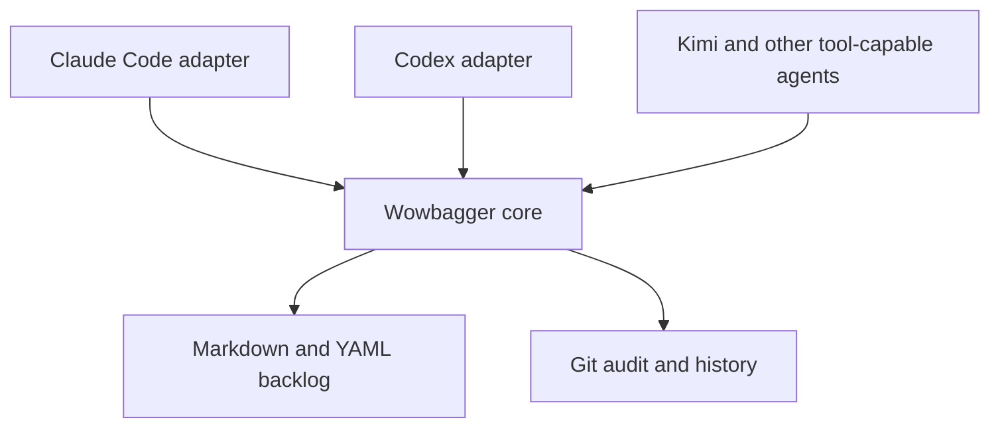

# wowbagger

**The backlog may be infinite. The next issue should not be ambiguous.**

Wowbagger is harness-neutral backlog coordination for coding agents, built on
plain Markdown and Git. It is intended to give agents durable work memory,
dependency-aware task selection, and auditable multi-worktree coordination without
putting a database or hosted service inside your repository.

> **Status: pre-alpha and self-hosted.** The standalone core validates a
> Markdown ledger, selects deterministic ready tasks, and implements guarded
> local `capabilities`, `inspect`, `create`, and `transition` commands. Its
> mutation scope is deliberately narrow: cooperative writers in one working
> copy, one item at a time. The harness-neutral adapter boundary is documented,
> but no adapter is shipped as a stable release. The core implements advisory
> work claims (`acquire`, `renew`, `release`, `read`), visible across the
> worktrees of one repository. They coordinate cooperating agents but enforce
> nothing: a non-cooperating writer still wins. Fenced work claims still
> require a transactional coordinator and are not available from the core CLI.

## Why the name?

Wowbagger the Infinitely Prolonged is a Douglas Adams character faced with an
absurdly large, strictly ordered list and the prospect of working through it
one entry at a time.

That is also a fair description of software maintenance.

The project is an independent literary nod and is not affiliated with or
endorsed by Douglas Adams' estate.

## The problem

Coding agents lose context. They are restarted, compacted, moved between
worktrees, or replaced by a different model. A useful backlog therefore cannot
live only in one conversation or one harness's private state.

Wowbagger makes the repository the durable coordination boundary:

- One inspectable Markdown file per backlog item.
- YAML metadata for lifecycle, dependencies, and structured provenance.
- Git history as the audit log and recovery mechanism.
- Dependency-aware ready queues so an agent can ask what is actionable now.
- Guarded one-item creation and lifecycle transitions with exact-byte
  revisions, cooperative locks, and explicit refusal when a change needs a
  multi-item transaction.
- A documented adapter boundary for tool-capable agent harnesses, without
  coupling the core to one vendor.
- Mechanical validation and derived reports instead of duplicated status data.

## Harness-neutral by design

Claude Code is an adapter, not the architecture. The core schema and command
interface will not depend on Claude-specific hooks, slash commands, paths, or
environment variables.



The documented compatibility targets are:

- Claude Code
- OpenAI Codex
- Kimi and other OpenAI-compatible model APIs hosted in agent harnesses that
  provide repository filesystem and command-execution tools

An OpenAI-compatible API describes model transport; it does not by itself
provide agent tools. The [adapter contract](docs/adapter-contract.md) records
the required host capabilities and refusal rules. It does not claim that API
compatibility alone makes a harness compatible, and this checkout does not ship
Claude, Codex, Kimi, or OpenAI-hosted adapters.

## Core commands

The current core requires Node.js 20 or later. From a Wowbagger checkout:

```sh
npm ci
./bin/wowbagger.js validate --ledger path/to/ledger --json
./bin/wowbagger.js ready --ledger path/to/ledger --as-of 2030-01-15 --json
./bin/wowbagger.js capabilities --json
./bin/wowbagger.js inspect --ledger path/to/ledger --id wb_... --json
./bin/wowbagger.js create --ledger path/to/ledger --input request.json --json
./bin/wowbagger.js transition --ledger path/to/ledger --input request.json --json
```

`validate` writes exactly one JSON result to standard output. A valid ledger
returns:

```json
{"valid":true,"errors":[]}
```

`ready` validates first, then returns only the normative ready result:

```json
{"as_of":"2030-01-15","valid":true,"ready":["wb_..."]}
```

`validate` and `ready` require `--ledger` and `--json`; `ready` also requires
an ISO calendar `--as-of` date. Invalid ledgers return the validation JSON and
exit nonzero. The core rejects invalid UTF-8, symbolic-link entries, unreadable
paths, and `.md` special files rather than returning a partial view. Real
directories ending in `.md` remain containers and are traversed. These checks
provide deterministic read hygiene; they are not a sandbox against a privileged
process racing filesystem changes.

`inspect` returns a lossless raw-byte snapshot and its SHA-256 revision.
`create` publishes only a caller-supplied canonical ID through atomic
no-clobber publication. `transition` compares the inspected revision while
cooperative per-ID locks are held, then changes one lifecycle item or refuses
the request if dependent cleanup or child disposition would require changing
another item. See [the mutation contract](docs/mutation-contract.md) for the
JSON request, response, recovery, and scope details. A lock is never a work
claim. See [the fenced work-claim contract](docs/work-claim-contract.md) for
the separate future claim protocol and its strict backend boundary.

## Install

The Claude Code plugin drives an installed core rather than bundling one, so a
version mismatch is detectable instead of silent. Install the executable from
the repository:

```sh
npm install -g github:lstutzman/wowbagger
wowbagger capabilities --json
```

The `contract_version` in that result is what an adapter or plugin declares it
requires. A consumer pairing a plugin with a core that reports a different
contract version gets a refusal, not a guess.

Direct checkout use — `./bin/wowbagger.js` from a clone — remains supported and
is what this repository's own ledger uses.

## Verify a checkout

The development workflow is intentionally self-hosted: edit code and ledger
fixtures locally, run the deterministic checks, and review the resulting Git
diff. Node.js 20 or later is required.

```sh
npm ci
npm test
npm audit --omit=dev
git diff --check
./bin/wowbagger.js validate --ledger ledger --json
```

The claim/fencing contract has its own normative documentation and fixtures in
[`docs/work-claim-contract.md`](docs/work-claim-contract.md); it remains an
in-progress protocol until merged and implemented by a supported backend.

## This repository's ledger

Wowbagger dogfoods its own draft format in the repository-local
[`ledger/`](ledger/) directory. Its standalone epic and current ready work track
only remaining standalone Wowbagger delivery. The ledger also contains a
separate, parentless, triage-only item recording possible future PropertyCompass
adoption as a deferred consumer decision. From a checkout, query it with the
current UTC date in place of `YYYY-MM-DD`:

```sh
./bin/wowbagger.js validate --ledger ledger --json
./bin/wowbagger.js ready --ledger ledger --as-of YYYY-MM-DD --json
```

See [CONTRIBUTING.md](CONTRIBUTING.md) for the small set of ledger-maintenance
rules and the limits of the local mutation runtime.

## Design principles

1. **Markdown is canonical.** Humans can inspect and edit the backlog using
   ordinary repository tools.
2. **Git provides auditability and conflict detection.** Do not introduce a
   second version-control system or an opaque synchronization layer.
3. **Derived state stays derived.** Ready queues, epic progress, and reports are
   computed rather than stored twice.
4. **Mechanism and policy are separate.** Lifecycle and generic ledger
   mechanics can be reused while each host repository keeps its own priorities
   and vocabulary.
5. **Adapters stay thin.** Harness packaging translates into the stable core;
   it does not fork core behavior.
6. **The implementation remains auditable.** Coordination tooling should be
   small enough for a human to understand and repair.

## Planned repository shape

```text
adapters/       Harness-specific packaging and instructions
docs/           Integration and operating guidance
scripts/        Harness-neutral commands
skills/         Portable agent workflows
spec/           Backlog schema, lifecycle contract, and synthetic fixtures
templates/      Backlog item templates
tests/          Shared black-box compatibility fixtures
```

The layout may change before the first release. The separation between the core
and its adapters will not.

## What Wowbagger is not

- An autonomous software factory or agent scheduler.
- A hosted issue tracker.
- A hidden agent-memory database.
- A Claude Code-only plugin.
- A replacement for engineering judgment about what should be built.

It is the durable work ledger beneath those systems.

## Roadmap

- Publish a standalone Markdown ledger contract and synthetic compatibility
  fixtures.
- Provide read-only validation and deterministic ready selection by creation
  order before mutable coordination. **Implemented in this checkout; not yet a
  stable release.**
- Implement the local-filesystem inspect, create, and single-item
  lifecycle-transition contract, including lossless exact-byte inspection,
  caller-known IDs, atomic no-clobber creation or refusal, and explicit
  multi-item refusal. **Implemented and covered by black-box vectors; still
  pre-alpha and intentionally local in scope.**
- Separate optional reusable mechanisms from consumer-specific policy.
- Stabilize the machine-readable command contract and compatibility evidence.
- Ship Claude Code and Codex adapters.
- Document the generic tool contract for other agent harnesses.
- Complete and review the separate portable claim and resolution contract;
  local mutation locks are not claims. **In progress on the claim branch; not
  merged or implemented by the standalone CLI.**
- Treat any PropertyCompass adoption as a later, separately-scoped consumer
  project.

## Contributing

The project has a pre-alpha standalone core. Issues describing concrete
portability requirements, coordination failures, or harness-integration
constraints are welcome. Please avoid proposing harness-specific behavior in
the core when it can live in an adapter.

For a change, create a focused branch, keep ledger edits reviewable, run the
verification commands above, and open a pull request with the tests and
contract links that justify the change. Do not claim support for an adapter or
fenced backend until its contract and implementation have merged.

## License

Licensed under the [Apache License 2.0](LICENSE).
