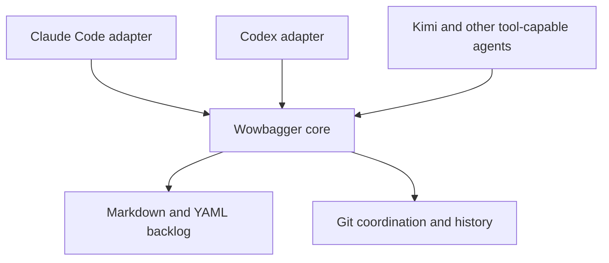

# wowbagger

**The backlog may be infinite. The next issue should not be ambiguous.**

Wowbagger is harness-neutral backlog coordination for coding agents, built on
plain Markdown and Git. It is intended to give agents durable work memory,
dependency-aware task selection, and auditable multi-worktree coordination without
putting a database or hosted service inside your repository.

> **Status: pre-alpha.** The standalone read-only core can validate a Markdown
> ledger and select its deterministic ready tasks. A proposed local
> single-item mutation contract and synthetic vectors are documented, but no
> mutation command exists yet. Claims, adapters, a stable release, and consumer
> adoption remain separate future work.

## Why the name?

Wowbagger the Infinitely Prolonged is a Douglas Adams character faced with an
absurdly large, strictly ordered list and the prospect of working through it
one entry at a time.

That is also a fair description of software maintenance.

The project is an independent literary nod and is not affiliated with or
endorsed by Douglas Adams' estate.

## The problem

Coding agents lose context. They are restarted, compacted, moved between
worktrees, or replaced by a different model. A useful backlog therefore cannot
live only in one conversation or one harness's private state.

Wowbagger makes the repository the durable coordination boundary:

- One inspectable Markdown file per backlog item.
- YAML metadata for lifecycle, dependencies, and structured provenance.
- Git history as the audit log and recovery mechanism.
- Dependency-aware ready queues so an agent can ask what is actionable now.
- A future path to capability-aware claims and guarded transitions, without
  treating either as part of the read-only core.
- Mechanical validation and derived reports instead of duplicated status data.

## Harness-neutral by design

Claude Code is an adapter, not the architecture. The core schema and command
interface will not depend on Claude-specific hooks, slash commands, paths, or
environment variables.



The initial compatibility targets are:

- Claude Code
- OpenAI Codex
- Kimi and other OpenAI-compatible model APIs hosted in agent harnesses that
  provide repository filesystem and command-execution tools

An OpenAI-compatible API describes model transport; it does not by itself
provide agent tools. Wowbagger integrations will document the host capabilities
they require rather than pretending API compatibility guarantees harness
compatibility.

## Read-only core

The current core requires Node.js 20 or later. From a Wowbagger checkout:

```sh
npm ci
./bin/wowbagger.js validate --ledger path/to/ledger --json
./bin/wowbagger.js ready --ledger path/to/ledger --as-of 2030-01-15 --json
```

`validate` writes exactly one JSON result to standard output. A valid ledger
returns:

```json
{"valid":true,"errors":[]}
```

`ready` validates first, then returns only the normative ready result:

```json
{"as_of":"2030-01-15","valid":true,"ready":["wb_..."]}
```

Both commands require `--ledger` and `--json`; `ready` also requires an ISO
calendar `--as-of` date. Invalid ledgers return the validation JSON and exit
nonzero. The core reads Markdown only, does not mutate the ledger, and rejects
invalid UTF-8, symbolic-link entries, unreadable paths, and `.md` special files
rather than returning a partial view. Real directories ending in `.md` remain
containers and are traversed. These checks provide deterministic read hygiene;
they are not a sandbox against a privileged process racing filesystem changes.

The executable is packaged as `wowbagger` for a future installation path. This
pre-alpha repository intentionally documents direct checkout use only.

## This repository's ledger

Wowbagger dogfoods its own draft format in the repository-local
[`ledger/`](ledger/) directory. Its standalone epic and current ready work track
only remaining standalone Wowbagger delivery. The ledger also contains a
separate, parentless, triage-only item recording possible future PropertyCompass
adoption as a deferred consumer decision. From a checkout, query it with the
current UTC date in place of `YYYY-MM-DD`:

```sh
./bin/wowbagger.js validate --ledger ledger --json
./bin/wowbagger.js ready --ledger ledger --as-of YYYY-MM-DD --json
```

See [CONTRIBUTING.md](CONTRIBUTING.md) for the small set of ledger-maintenance
rules while mutation commands are still under development.

## Design principles

1. **Markdown is canonical.** Humans can inspect and edit the backlog using
   ordinary repository tools.
2. **Git provides auditability and conflict detection.** Do not introduce a
   second version-control system or an opaque synchronization layer.
3. **Derived state stays derived.** Ready queues, epic progress, and reports are
   computed rather than stored twice.
4. **Mechanism and policy are separate.** Lifecycle and generic ledger
   mechanics can be reused while each host repository keeps its own priorities
   and vocabulary.
5. **Adapters stay thin.** Harness packaging translates into the stable core;
   it does not fork core behavior.
6. **The implementation remains auditable.** Coordination tooling should be
   small enough for a human to understand and repair.

## Planned repository shape

```text
adapters/       Harness-specific packaging and instructions
docs/           Integration and operating guidance
scripts/        Harness-neutral commands
skills/         Portable agent workflows
spec/           Backlog schema, lifecycle contract, and synthetic fixtures
templates/      Backlog item templates
tests/          Shared black-box compatibility fixtures
```

The layout may change before the first release. The separation between the core
and its adapters will not.

## What Wowbagger is not

- An autonomous software factory or agent scheduler.
- A hosted issue tracker.
- A hidden agent-memory database.
- A Claude Code-only plugin.
- A replacement for engineering judgment about what should be built.

It is the durable work ledger beneath those systems.

## Roadmap

- Publish a standalone Markdown ledger contract and synthetic compatibility
  fixtures.
- Provide read-only validation and deterministic ready selection by creation
  order before mutable coordination. **Implemented in this checkout; not yet a
  stable release.**
- Define the proposed local-filesystem inspect, create, and single-item
  lifecycle-transition contract, including lossless exact-byte inspection,
  caller-known IDs, atomic no-clobber creation or refusal, and explicit
  multi-item refusal. **Documented only; not yet executable.**
- Separate optional reusable mechanisms from consumer-specific policy.
- Stabilize the machine-readable command contract and compatibility evidence.
- Ship Claude Code and Codex adapters.
- Document the generic tool contract for other agent harnesses.
- Define work claims only after a separate portable claim and resolution
  contract exists; local mutation locks are not claims.
- Treat any PropertyCompass adoption as a later, separately-scoped consumer
  project.

## Contributing

The project is at the architecture and contract stage. Issues describing
concrete portability requirements, coordination failures, or harness-integration
constraints are welcome. Please avoid proposing harness-specific behavior in the
core when it can live in an adapter.

## License

Licensed under the [Apache License 2.0](LICENSE).
