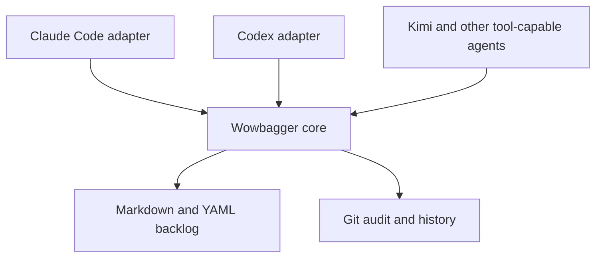

# wowbagger

**The backlog may be infinite. The next issue should not be ambiguous.**

Wowbagger is harness-neutral backlog coordination for coding agents, built on
plain Markdown and Git. It is intended to give agents durable work memory,
dependency-aware task selection, and auditable multi-worktree coordination without
putting a database or hosted service inside your repository.

> **Status: pre-alpha and self-hosted.** The standalone core validates a
> Markdown ledger, selects deterministic priority-ordered ready tasks, and
> implements guarded local `capabilities`, `inspect`, `create`, `transition`,
> and `patch` commands, plus `mint-id` for canonical item IDs. Its mutation
> scope is deliberately narrow: cooperative writers in one working copy, one
> item at a time. A Claude Code adapter and plugin ship from this
> repository; the adapter answers the negotiation surface of the harness-neutral
> contract and passes all 196 assertions across all 15 cases on native Darwin.
> The Claude Code adapter declares Darwin `supported`; all other shipped adapter
> platform declarations remain `unverified`. The shipped core mutation contract
> and adapter contract are version 2; their frozen version 1 definitions are not
> silently negotiated.
>
> A work claim is not a lock or an exclusive dispatch lease. On Git-backed
> ledgers, claims coordinate cooperating agents through a durable journal in
> Git's shared common directory. `claim acquire` uses
> observed-state compare-and-swap. `publish-claimed` fences one item against
> the active owner generation and expected revision. `claim-verify` reconciles
> response-loss and post-merge outcomes. This is **merge-coordinated**, not
> `safe_exclusive_dispatch`: direct writes, hostile processes, other clones,
> and non-claim-aware tools can still bypass the protocol.

## Start here

Install the core CLI, then verify it:

```sh
npm install -g wowbagger@next   # public npm prerelease
# or, from this release's Git tag:
# npm install -g github:lstutzman/wowbagger#v0.1.0-alpha.4
wowbagger capabilities --json
```

In Claude Code, add the plugin:

```
/plugin marketplace add lstutzman/wowbagger
/plugin install wowbagger@wowbagger
```

The plugin drives the installed core rather than bundling one, so a mismatch is
detectable instead of silent. Its skill reads `wowbagger --version` and
`capabilities`; it requires the same distribution version as the plugin and
core contract version 2. It refuses an absent or incompatible core. It will not
fall back to editing ledger files by hand, because that would bypass validation
and atomic publication.

Decide where items live **before your first `create`**. A ledger publishes items
to `<ledger>/<id>.md` unless a committed `<ledger>/.wowbagger/layout.json` binds
a subdirectory:

```sh
mkdir -p path/to/ledger/.wowbagger path/to/ledger/items
echo '{"layout_version":1,"items_directory":"items"}' > path/to/ledger/.wowbagger/layout.json
```

`layout_version` must be `1` and `items_directory` names the committed item
directory. `create` then publishes atomically to `<items_directory>/<id>.md`,
and validation rejects parsed items outside it. Commit the directory the file
names — `create` publishes into an existing directory and does not make one.
Nothing is renamed after a create. Cores at `0.1.0-alpha.4` and earlier ignore
the file and publish every item at the ledger root.

On such a core, relocating an item by hand has a trap. `create` writes an
untracked file, so `git mv` refuses the path it just published; an unchecked
batch then runs `git add -A` and commits the item at the ledger root, where it
silently stays. Use plain `mv`, then `git add` both paths, and check the exit
code of every command before the commit:

```sh
mv path/to/ledger/<id>.md path/to/ledger/items/<id>.md || exit 1
git add path/to/ledger || exit 1
```

A committed item outside the configured items directory then fails validation
and refuses every read and every guarded mutation on that ledger, including
ones that never touch it. The refusal names the expected path and the
relocation that repairs it.

For an isolated consumer pilot, create or select the disposable worktree before
the agent starts. Then launch a new session with that worktree as its project
root. Follow the [isolated dogfood pilot runbook](docs/isolated-dogfood-pilot.md);
do not try to drive a sibling worktree from an already-running agent session.

To use the core directly from a clone instead, see
[Core commands](#core-commands).

## Installation, compatibility, and security

### Installation routes

Wowbagger ships as an npm package with a single `wowbagger` binary. There are
two supported install routes:

- **npm registry** — `npm install -g wowbagger@next` installs the current
  prerelease.
- **git tag** —
  `npm install -g github:lstutzman/wowbagger#v0.1.0-alpha.4` installs this
  release. Installing at a ref installs the core and every adapter that ref
  carries.

Either route installs the core and the `wowbagger` command. The Claude Code
plugin is a separate artifact (see [Start here](#start-here)); the core and the
plugin are installed independently. Install their matching distribution
versions.

### Compatibility

The contract version is top-level `contract_version`, reported by
`wowbagger capabilities --json`. Contracts change it; refactors do not. The
npm/Git distribution version names release bytes. General API consumers
negotiate the contract version. The shipped plugin skill additionally requires
the exact core distribution version that shipped with it, because its
instructions can depend on additive behavior from that release.

- **Node.js:** 20 and later. The adapter conformance vectors run against Node
  20 and the current runtime before each release.
- **Platforms:** the core runs wherever Node.js runs. The Claude Code adapter
  declares Darwin `supported` from native common-vector evidence. Linux,
  Windows, and the other shipped adapter targets remain `unverified`; do not
  infer support only because the CLI starts.
- **Other tooling:** `wowbagger` manages a Git-tracked Markdown ledger. It
  needs an accessible Git checkout for work-claim and namespace operations.
  Before `provision`, run
  `wowbagger claim capabilities --ledger <dir> --json` and require
  `result.operations.work_claim.supported: true`.

### Security

- **Read-only by default.** `validate`, `ready`, `inspect`, `capabilities`, and
  `mint-id` never modify anything. Every mutation (`create`, `transition`,
  `patch`, and `publish-claimed`) is an explicit, reviewable write.
- **Lock is not a claim.** A short mutation lock serializes writers during one
  operation. It does not grant a work claim.
- **Claims are merge-coordinated, not exclusive.** `claim acquire` uses
  compare-and-swap against the observed claim state. `publish-claimed` checks
  the active owner generation and expected ledger revision before it writes
  one item. `claim-verify` records the final Git outcome and detects later
  revision drift. Legacy `create` and `transition` refuse claim conflicts.
- **Local authority only.** The protocol protects cooperating worktrees in one
  Git repository. It does not stop direct filesystem writes, hostile
  processes, other clones, or alternate write paths. Capability discovery
  therefore reports `mode: "merge-coordinated"` and
  `safe_exclusive_dispatch: false`.
- **Supply chain.** Install only from the npm registry or this repository's
  git tags, and verify the `contract_version` your adapter or script requires.

This README is documentation, not a substitute for the contracts. The
machinery behind these properties is specified in [SPEC.md](SPEC.md),
[docs/mutation-contract.md](docs/mutation-contract.md), and
[docs/work-claim-contract.md](docs/work-claim-contract.md).

## Upgrading from an earlier wowbagger

This section is written for agents as much as humans: if you already drive a
wowbagger core, this is how you move forward safely.

Upgrade the pieces you installed:

```sh
npm install -g wowbagger@next                  # public npm registry
npm install -g github:lstutzman/wowbagger#v0.1.0-alpha.4  # immutable Git release
git pull && npm ci                            # or: a direct checkout
```

In Claude Code, update the plugin the same way it was installed:

```
/plugin marketplace update wowbagger
/plugin update wowbagger@wowbagger
```

```sh
wowbagger --version
wowbagger capabilities --json
```

The plugin requires its exact core distribution version and top-level core
`contract_version: 3`. Direct API consumers must check the contract version
they support; installed plugin users must also keep the plugin and core
distribution versions equal.

The shipped adapter selects only adapter contract version 2 and requires core
contract version 3. The adapter contract and the core contract are separate
version domains: the adapter stays at 2 while the core moves to 3. A v1-only
consumer receives
`unsupported-adapter-contract-version`; it does not receive v2 behavior. The
schema-2 transport is available. Ledger migration remains a separate quiesced
maintenance operation. The
[schema-2 migration runbook](docs/schema-2-migration.md) documents the required
backup, dry run, explicit `--apply`, lock refusal, and recovery procedure. The
tool is dry-run-only by default:

```sh
TMPDIR=/tmp node scripts/migrate-schema-2.js --ledger path/to/ledger
```

Behaviour changes are recorded in [CHANGELOG.md](CHANGELOG.md) — read its
Unreleased section on every upgrade. If you automated against an earlier
core, these are the changes most likely to touch you:

- **Stop hand-editing frontmatter for priority or number.** `wowbagger patch`
  changes both under the same revision compare-and-swap and per-ID lock as
  `transition`. Hand-edits bypass validation and atomic publication.
- **Delete your local ULID generator.** `wowbagger mint-id --json` prints a
  canonical ID; `--date YYYY-MM-DD` selects the creation date the ID must
  encode.
- **Read `core.number` and `core.priority` from results** instead of decoding
  `source_base64`. Every frontmatter field lives under `item.core`; `item.id`
  is the one deliberate duplicate.
- **`ready` without `--json` is for you to read**: `#number pri=priority
  title` per line, in ready order. Machine consumers keep `ready --json`,
  which is byte-stable.
- **A claim request with an own `__proto__` member is now refused** as
  `invalid-request` instead of silently losing the member.
- **`create` tells you where the item landed**: results report
  `core.status: "triage"`, and the refusal for a caller-supplied `status`
  names the accepting transition (triage to backlog) that makes an item
  ready.
- **Bind a subdirectory layout in the ledger, not in each runner.** Commit
  `<ledger>/.wowbagger/layout.json` with
  `{"layout_version":1,"items_directory":"items"}`. `create` then derives
  `<ledger>/items/<id>.md`; validation rejects parsed items outside `items/`.
  Without the file, the compatible layout remains `<ledger>/<id>.md`.

## Why the name?

Wowbagger the Infinitely Prolonged is a Douglas Adams character faced with an
absurdly large, strictly ordered list and the prospect of working through it
one entry at a time.

That is also a fair description of software maintenance.

The project is an independent literary nod and is not affiliated with or
endorsed by Douglas Adams' estate.

## The problem

Coding agents lose context. They are restarted, compacted, moved between
worktrees, or replaced by a different model. A useful backlog therefore cannot
live only in one conversation or one harness's private state.

Wowbagger makes the repository the durable coordination boundary:

- One inspectable Markdown file per backlog item.
- YAML metadata for lifecycle, priority, dependencies, and structured provenance.
- Git history as the audit log and recovery mechanism.
- Dependency-aware ready queues so an agent can ask what is actionable now.
- Guarded one-item creation and lifecycle transitions with exact-byte
  revisions, cooperative locks, and explicit refusal when a change needs a
  multi-item transaction.
- A documented adapter boundary for tool-capable agent harnesses, without
  coupling the core to one vendor.
- Mechanical validation and derived reports instead of duplicated status data.

## Harness-neutral by design

Claude Code is an adapter, not the architecture. The core schema and command
interface will not depend on Claude-specific hooks, slash commands, paths, or
environment variables.



The documented compatibility targets are:

- Claude Code
- OpenAI Codex
- Kimi and other OpenAI-compatible model APIs hosted in agent harnesses that
  provide repository filesystem and command-execution tools

An OpenAI-compatible API describes model transport; it does not by itself
provide agent tools. The [adapter contract](docs/adapter-contract.md) records
the required host capabilities and refusal rules, and
[the integration guide](docs/openai-compatible-integration.md) states what a
Kimi or other OpenAI-compatible host can do today — driving the core CLI
directly — versus what a verifiable compatibility claim requires. Neither
claims that API compatibility alone makes a harness compatible.

This checkout ships three adapter packages on one shared entrypoint runtime:
[`adapters/claude-code/`](adapters/claude-code/), [`adapters/codex/`](adapters/codex/),
and [`adapters/opencode/`](adapters/opencode/). Each answers the section 3.3 bootstrap
wire with its own identity and honest host declaration. The native Darwin
Claude Code report passes all 196 assertions across all 15 cases — run
`node spec/run-adapter-implementation.js` to see the evidence. Codex and
OpenCode share the version 2 engine and execute all 196 assertions with
`--target codex` or `--target opencode`, but both target reports remain `fail`
pending target-specific evidence. Invocation forwarding, path and limit guards,
approval, and context all enter through the shared shipped engine. Platform
declarations remain `unverified` until their separate release evidence is
accepted. The Kimi and
OpenAI-compatible harness adapters are not written.

## Core commands

The current core requires Node.js 20 or later. From a Wowbagger checkout, `./bin/wowbagger.js --help`
prints the full command inventory, `./bin/wowbagger.js <command> --help` prints that
command's usage, and `./bin/wowbagger.js --version` prints the installed package
version. The commands below are the current inventory:

```sh
npm ci
./bin/wowbagger.js validate --ledger path/to/ledger --json
./bin/wowbagger.js ready --ledger path/to/ledger --as-of 2030-01-15 --json
./bin/wowbagger.js ready --ledger path/to/ledger --as-of 2030-01-15
./bin/wowbagger.js report --ledger path/to/ledger --as-of 2030-01-15 --json
./bin/wowbagger.js capabilities --json
./bin/wowbagger.js mint-id --json
./bin/wowbagger.js inspect --ledger path/to/ledger --id wb_... --json
./bin/wowbagger.js create --ledger path/to/ledger --input request.json --json
./bin/wowbagger.js transition --ledger path/to/ledger --input request.json --json
./bin/wowbagger.js patch --ledger path/to/ledger --input request.json --json
./bin/wowbagger.js provision --ledger path/to/ledger --json
./bin/wowbagger.js claim capabilities --ledger path/to/ledger --json
./bin/wowbagger.js claim acquire --ledger path/to/ledger --input request.json --json
./bin/wowbagger.js claim read --ledger path/to/ledger --input request.json --json
./bin/wowbagger.js claim renew --ledger path/to/ledger --input request.json --json
./bin/wowbagger.js claim release --ledger path/to/ledger --input request.json --json
./bin/wowbagger.js publish-claimed --ledger path/to/ledger --input request.json --json
./bin/wowbagger.js claim-verify --ledger path/to/ledger --json
```

`validate` writes exactly one JSON result to standard output. A valid ledger
returns:

```json
{"valid":true,"errors":[]}
```

`ready` validates first, then returns only the normative ready result:

```json
{"as_of":"2030-01-15","valid":true,"ready":["wb_..."]}
```

`validate` and `ready` require `--ledger`; `ready` also requires an ISO
calendar `--as-of` date. Without `--json`, `ready` prints a human queue —
`#number pri=priority title` per ready item — while `ready --json` stays
byte-stable for machine consumers. Invalid ledgers return the validation JSON and
exit nonzero. The core rejects invalid UTF-8, symbolic-link entries, unreadable
paths, and `.md` special files rather than returning a partial view. Real
directories ending in `.md` remain containers and are traversed. These checks
provide deterministic read hygiene; they are not a sandbox against a privileged
process racing filesystem changes.

`report` validates the complete ledger, reads `.wowbagger/report.json`, and
atomically publishes one self-contained HTML file. The output must be outside
the ledger. Relative configured output paths resolve from `.wowbagger/`;
relative `--out` overrides resolve from the caller's working directory.

```json
{
  "report_version": 1,
  "repository": { "name": "Example repository", "logo": "logo.svg" },
  "title": "Ledger report",
  "output": "../../ledger-report.html",
  "fields": {
    "area": "/priority_area",
    "complexity": "/complexity",
    "rank": "/priority_rank",
    "class": "/class",
    "due": "/due"
  },
  "swarm": { "eligible_complexities": ["small", "medium"] }
}
```

`repository.logo`, `fields`, and `swarm` are optional. Field values resolve
from parsed frontmatter with RFC 6901 JSON Pointers. A swarm requires mapped
`area` and `complexity` fields. It contains no external runtime dependency.

The report opens with **Work next**: the ready set in a recommended order,
each entry carrying the factors that placed it. Below it sit **Attention**
(blocked work naming its blockers, the oldest open work, and started work past
this ledger's own 85th-percentile cycle time) and the **evidence layer**
(aging buckets, weekly arrivals against completions, accept-to-complete cycle
time, and a Monte Carlo forecast as 50 and 85 percent bands). State counts,
item cards, filters, grouping, detail levels, terminal history, and
area-diverse ready batches all remain, demoted below that decision surface.

The recommended order is a report-layer derivation. It is recomputed from
ledger bytes at render time, never persisted, never a mutation, and it does not
change `ready`: the core still selects and sorts by priority, created date,
then ID. Ordering runs as separate, visible steps rather than one opaque score
— expedite class, then due proximity, then transitive unblocking leverage over
`depends_on`, then epic enablement from `parent`, then priority, then age, then
the mapped `complexity` as a WSJF-style size denominator — and every step that
placed an entry is printed beside it.

Two mapped fields carry the value dimensions the schema deliberately does not:

- **`class`** — a class of service, one of `expedite`, `fixed-date`,
  `standard`, or `intangible`. `expedite` lifts an item above every other ready
  item. An absent value means `standard`. An unrecognised value is ranked as
  standard and reported by number in the report, never silently dropped.
- **`due`** — an ISO calendar date. The nearest due date sorts first and an
  overdue one sorts first of all; an item with no due date sorts behind every
  dated one at that step.

Both ride the ordinary extension-member channel, so the core neither reads nor
validates them. `complexity` weighs `xs`/`s`/`small` as 1, `m`/`medium` as 2,
`l`/`large` as 3, and `xl`/`extra-large` as 5; any other value carries no
weight and is shown as written.

This repository keeps its report configuration in
`ledger/.wowbagger/report.json`. Generate the ignored local report with:

```sh
npm run report -- --as-of 2026-08-14
```

`inspect` returns a lossless raw-byte snapshot and its SHA-256 revision.
`create` publishes only a caller-supplied canonical ID through atomic
no-clobber publication — `mint-id` prints one, so no consumer writes base32
by hand. `transition` compares the inspected revision while cooperative
per-ID locks are held, then changes one lifecycle item or refuses the request
if dependent cleanup or child disposition would require changing another
item. `patch` changes the caller-supplied `number` and `priority` fields —
nothing else — under the same lock and compare-and-swap. See
[the mutation contract](docs/mutation-contract.md) for the JSON request,
response, recovery, and scope details.

`provision` binds one ledger namespace to the repository. `claim` manages
durable acquire, read, renew, and release decisions. `publish-claimed` accepts
the exact candidate item bytes and fences their publication against the active
owner generation and expected revision. `claim-verify` reconciles pending
publication outcomes against the working tree and Git `HEAD`; run it after a
claimed publication is committed or merged, and before the next fenced
operation. See [the work-claim contract](docs/work-claim-contract.md) for the
request envelopes, refusal precedence, recovery rules, and the difference
between strict fenced and merge-coordinated backends.

Core and work-claim versions use distinct negotiation fields. Read the
top-level `contract_version` from core `capabilities`. Read
`result.operations.work_claim.api_version` from
`claim capabilities --ledger <dir> --json`. A claim response's top-level
`contract_version` is the legacy claim-envelope marker; do not compare it with
the core version. A contract consumer that receives an unsupported version
refuses rather than guessing. The shipped plugin skill also requires its exact
core distribution version. Direct checkout use—`./bin/wowbagger.js` from a
clone—remains supported and is what this repository's own ledger uses.

## Commit each mutation before the next one

On a **provisioned** ledger — one where `provision` has bound a namespace and
`claim capabilities` reports `mode: "merge-coordinated"` — there is one
operating rule:

**Commit each mutation to Git before running the next mutating command.**

The durable claim store validates every recorded mutation against Git `HEAD`,
not against working-tree bytes. That is what makes a recorded mutation durable
rather than a local edit one `git checkout` away from vanishing. An uncommitted
mutation is an unreconciled mutation, so the next `create`, `transition`, or
`patch` refuses instead of writing on top of it.

The loop that works:

```sh
./bin/wowbagger.js create --ledger path/to/ledger --input request.json --json
git add path/to/ledger && git commit -m "Record the mutation"
./bin/wowbagger.js claim-verify --ledger path/to/ledger --json
./bin/wowbagger.js transition --ledger path/to/ledger --input next.json --json
```

Skip the commit and the next command returns exit 6:

```json
{"ok":false,"namespace":"ledger-mutation","command":"create-v1","contract_version":1,
 "state":"unchanged","error":{"code":"claim-store-unavailable",
 "message":"The durable claim store is unavailable.",
 "details":{"reason":"publication-reconciliation-required","findings":[{
   "code":"stale-write-detected","reason":"git-finalization-required",
   "expected_path":"wb_....md",
   "remediation":"Commit wb_....md in Git, then run claim-verify."}]}}}
```

`state: "unchanged"` is exact — nothing was written. **`claim-verify` is the
reconciliation procedure.** Read `details.findings`, do what each
`remediation` string says, run `claim-verify` until it returns exit 0, then
repeat the refused command.

Full rules, the other blocking finding codes, and why validating against
working-tree bytes was rejected are in
[the mutation contract](docs/mutation-contract.md) section 12 and
[the work-claim contract](docs/work-claim-contract.md).

## Verify a checkout

The development workflow is intentionally self-hosted: edit code and ledger
fixtures locally, run the deterministic checks, and review the resulting Git
diff. Node.js 20 or later is required.

```sh
npm ci
npm test
npm audit --omit=dev
git diff --check
./bin/wowbagger.js validate --ledger ledger --json
```

The work-claim contract has normative documentation and fixtures in
[`docs/work-claim-contract.md`](docs/work-claim-contract.md). The shipped
Git-backed profile is merge-coordinated and deliberately does not claim
`safe_exclusive_dispatch`.

## This repository's ledger

Wowbagger dogfoods its own draft format in the repository-local
[`ledger/`](ledger/) directory. Two epics divide the work, and the boundary is
clean: if it changes what the core does it belongs to standalone v0; if it
changes how the core reaches a consumer it belongs to productization. A
separate, triage-only item records a possible future PropertyCompass backlog
migration as a deferred consumer decision, gated on merge-coordinated work
claims and an explicit adoption decision. From a
checkout, query the ledger with the current UTC date in place of `YYYY-MM-DD`:

```sh
./bin/wowbagger.js validate --ledger ledger --json
./bin/wowbagger.js ready --ledger ledger --as-of YYYY-MM-DD --json
```

See [CONTRIBUTING.md](CONTRIBUTING.md) for the small set of ledger-maintenance
rules and the limits of the local mutation runtime.

## Design principles

1. **Markdown is canonical.** Humans can inspect and edit the backlog using
   ordinary repository tools.
2. **Git provides auditability and conflict detection.** Do not introduce a
   second version-control system or an opaque synchronization layer.
3. **Derived state stays derived.** Ready queues, epic progress, and reports are
   computed rather than stored twice.
4. **Mechanism and policy are separate.** Lifecycle and generic ledger
   mechanics can be reused while each host repository keeps its own priorities
   and vocabulary.
5. **Adapters stay thin.** Harness packaging translates into the stable core;
   it does not fork core behavior.
6. **The implementation remains auditable.** Coordination tooling should be
   small enough for a human to understand and repair.

## Repository shape

```text
src/            The core, and the shared adapter engine in src/adapter/
bin/            The wowbagger executable
adapters/       Harness packaging — claude-code, codex, and opencode packages
skills/         Portable agent workflows shipped by the plugin
spec/           Ledger schema, the adapter reference model, and normative fixtures
test/           The test suite
docs/           Contracts, integration guidance, and handoffs
scripts/        Maintenance commands that stay outside the core mutation contract
ledger/         This repository's own backlog, managed by wowbagger itself
```

`spec/adapter-reference.js` is an independent oracle. `src/adapter/`
deliberately re-implements it rather than importing it, and a differential test
holds the two together — the same arrangement `src/claim-request.js` has with
`test/work-claim-reference.js`. Collapsing either pair into a shared
implementation would make its conformance tests prove nothing.

The layout may change before the first release. The separation between the core
and its adapters will not.

## What Wowbagger is not

- An autonomous software factory or agent scheduler.
- A hosted issue tracker.
- A hidden agent-memory database.
- A Claude Code-only plugin.
- A replacement for engineering judgment about what should be built.

It is the durable work ledger beneath those systems.

## Roadmap

- Publish a standalone Markdown ledger contract and synthetic compatibility
  fixtures.
- Provide read-only validation and deterministic ready selection by creation
  order before mutable coordination. **Implemented in this checkout; not yet a
  stable release.**
- Implement the local-filesystem inspect, create, and single-item
  lifecycle-transition contract, including lossless exact-byte inspection,
  caller-known IDs, atomic no-clobber creation or refusal, and explicit
  multi-item refusal. **Implemented and covered by black-box vectors; still
  pre-alpha and intentionally local in scope.**
- Separate optional reusable mechanisms from consumer-specific policy.
- Stabilize the machine-readable command contract and compatibility evidence.
- Ship Claude Code and Codex adapters. **Claude Code, Codex, and OpenCode
  packages share the version 2 engine; the Claude Code manifest declares Darwin
  `supported` after passing all 196 native assertions. Other adapter targets and
  platform declarations remain unverified.**
- Document the generic tool contract for other agent harnesses.
- Implement merge-coordinated work claims for cooperating Git worktrees.
  **Implemented with durable claim operations, claim-protected single-item
  publication, and Git reconciliation. It deliberately reports
  `safe_exclusive_dispatch: false`; direct writes and other uncoordinated paths
  remain bypasses.**
- Treat any PropertyCompass adoption as a later, separately-scoped consumer
  project.

## Contributing

The project has a pre-alpha standalone core. Issues describing concrete
portability requirements, coordination failures, or harness-integration
constraints are welcome. Please avoid proposing harness-specific behavior in
the core when it can live in an adapter.

For a change, create a focused branch, keep ledger edits reviewable, run the
verification commands above, and open a pull request with the tests and
contract links that justify the change. Do not claim support for an adapter or
fenced backend until its contract and implementation have merged.

## License

Licensed under the [Apache License 2.0](LICENSE).
